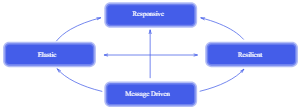

# Reactive Systems

---

## Table of Contents
<!-- TOC -->
* [Reactive Systems](#reactive-systems)
  * [Table of Contents](#table-of-contents)
  * [Overview](#overview)
  * [Reactive Manifesto](#reactive-manifesto)
    * [Responsiveness](#responsiveness)
    * [Resilience](#resilience)
    * [Elasticity](#elasticity)
    * [Message-Driven](#message-driven)
  * [Characteristics of Reactive Systems](#characteristics-of-reactive-systems)
  * [Examples](#examples)
  * [Ref.](#ref)
<!-- TOC -->

---

## Overview
Reactive Systems is an architectural style and design approach for building software systems that are *responsive*, *resilient*, *elastic*, and *message-driven*. 

This style emerged as a response to the challenges posed by modern, highly distributed, and dynamic environments, such as those found in web applications, IoT (Internet of Things) systems, real-time analytics, and more. Reactive Systems are designed to handle large amounts of concurrent users, events, and data streams while maintaining high availability and responsiveness.

[Back to top](#table-of-contents)

## Reactive Manifesto
The Reactive Manifesto is a document that outlines the guiding principles and characteristics of reactive systems. It was created to provide a set of guidelines for building responsive, resilient, elastic, and message-driven applications that can handle the challenges of modern distributed and concurrent computing environments.

The Reactive Manifesto defines four key principles that reactive systems should embody:

[Back to top](#table-of-contents)

### Responsiveness

Reactive Systems prioritize responsiveness by `ensuring that the system reacts quickly` to incoming events and requests, providing timely and consistent feedback to users. This responsiveness enhances the user experience and allows the system to adapt to varying workloads.

[Back to top](#table-of-contents)

### Resilience

Reactive Systems are built to `remain operational even in the face of failures, errors, or unexpected events`. They use techniques such as isolation, replication, and error recovery mechanisms to ensure that failures in one part of the system do not lead to complete system outages.

[Back to top](#table-of-contents)

### Elasticity

Reactive Systems can `dynamically scale their resources up or down` based on the current workload and demand. This elasticity allows them to handle varying levels of traffic and resource requirements efficiently, optimizing resource utilization.

[Back to top](#table-of-contents)

### Message-Driven

Communication between different components and services in a Reactive System `is typically asynchronous and message-driven`. This approach allows components to interact in a decoupled manner, enabling better isolation, fault tolerance, and scalability.

[Back to top](#table-of-contents)

## Characteristics of Reactive Systems

- **Event-Driven**: Reactive Systems are often built around the concept of events, where `changes or occurrences are represented as events` that trigger reactions within the system. Event-driven architectures enable real-time processing and the handling of continuous streams of data.

- **Data Streaming**: Many Reactive Systems involve processing and reacting to streams of data, such as sensor readings, user interactions, or real-time analytics. They leverage technologies like stream processing frameworks to `handle and analyze data in motion`.

- **Location Transparency**: Components within a Reactive System can be distributed across different locations, data centers, or cloud providers. Location transparency means that the `system handles communication and data exchange seamlessly regardless of where the components are located`.

- **Autonomy**: Components within a Reactive System are designed to be autonomous and independent. This autonomy allows for better isolation, resilience, and the `ability to update or replace components without affecting the entire system`.

- **Consistency and Eventual Consistency**: Reactive Systems may prioritize availability and partition tolerance over strict consistency in distributed scenarios. They often embrace eventual consistency, where `data consistency is achieved over time as the system processes events and transactions`.

- **Reactive Streams**: Reactive Streams is a specification for handling asynchronous stream processing, providing standardized interfaces for handling data streams with backpressure, allowing for `better control of resource usage and avoiding overload`.

[Back to top](#table-of-contents)

## Examples

Reactive systems architecture is a smart choice when you're building software that needs to handle a lot of things happening at once, like many users or lots of data coming in quickly. It's like having a system that can stay responsive even when things get busy, can bounce back from problems without crashing, and can change its size to handle more or less work.

Here are a few examples of systems where a reactive architecture fits well:

- **Online Shopping Platforms**: When many users are shopping at the same time, adding items to their carts, and checking out, a reactive system can ensure that the website stays responsive and doesn't slow down or crash.

- **Social Media Platforms**: Platforms like Facebook or Twitter need to handle a huge number of posts, likes, comments, and interactions from users in real-time. A reactive architecture helps maintain responsiveness even during peak usage.

- **IoT (Internet of Things) Systems**: Devices like smart thermostats, security cameras, and wearable gadgets constantly send data to be processed. A reactive system can handle this constant stream of data and respond quickly to changes.

- **Financial Trading Platforms**: Stock markets involve rapid and unpredictable changes. Reactive systems can process a large number of trades and updates in real-time while staying resilient to sudden changes.

- **Ride-Sharing Apps**: Apps like Uber or Lyft need to handle a lot of ride requests, driver locations, and map updates. A reactive architecture can ensure that users get quick responses and that the app remains functional even during high-demand periods.

- **Real-Time Analytics**: Systems that analyze data as it arrives, such as monitoring user behavior on a website or analyzing sensor data in manufacturing processes, benefit from reactive architectures to provide instant insights.

- **Online Gaming**: Multiplayer online games require real-time interactions between players and the game world. A reactive architecture ensures that actions and updates are processed quickly to provide a seamless gaming experience.

- **Healthcare Monitoring**: Medical devices that collect and transmit patient data need to be responsive and reliable. Reactive systems can handle the constant flow of data and ensure that critical information is processed without delays.

- **Traffic Management Systems**: Systems that monitor and control traffic flow, such as intelligent traffic lights or navigation apps, require quick responses to changing conditions on the road.

- **Content Streaming Platforms**: Services like Netflix or YouTube need to deliver video content to many users simultaneously. Reactive architectures help in providing smooth playback and adapting to varying network conditions.

[Back to top](#table-of-contents)

___

## Ref.

- https://www.lightbend.com/white-papers-and-reports/reactive-programming-versus-reactive-systems

___

[Get Started](../../get-started.md#architectural-patterns) 

---