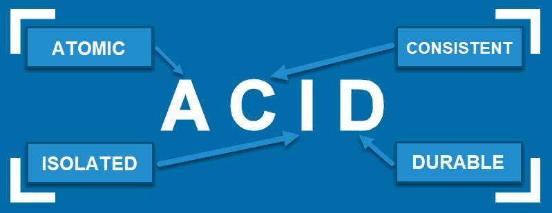

# ACID

## Table of Contents
<!-- TOC -->
* [ACID](#acid)
  * [Table of Contents](#table-of-contents)
  * [Atomicity](#atomicity)
  * [Consistency](#consistency)
  * [Isolation](#isolation)
  * [Durability](#durability)
  * [Ref.](#ref)
<!-- TOC -->

---

ACID is an acronym that stands for **Atomicity**, **Consistency**, **Isolation**, and **Durability**. It is a set of properties or characteristics that ensure the reliable and predictable behavior of database transactions. 

ACID is used to guarantee the integrity of data within a relational database management system (RDBMS) even in the presence of hardware failures, software bugs, or other unexpected issues.

## Atomicity

This property ensures that a _transaction is treated as a single, indivisible unit of work_. 

Either all the changes made within a transaction are committed, or none of them are. 

If a failure occurs during the execution of a transaction, the system will roll back any changes made, maintaining the database in a consistent state.

[Back to top](#table-of-contents)

## Consistency

Consistency ensures that a transaction brings the database from one valid state to another. In other words, the data is transformed according to predefined rules and constraints, maintaining its validity and integrity. Any transaction that violates these rules is not allowed to complete.

[Back to top](#table-of-contents)

## Isolation

Isolation guarantees that transactions can run concurrently without interfering with each other. Each transaction is isolated from others, and their effects are not visible to other transactions until they are committed. This prevents situations like dirty reads, where one transaction reads uncommitted changes made by another transaction.

[Back to top](#table-of-contents)

## Durability
Durability ensures that once a transaction is committed, its changes are permanent and will survive any subsequent failures, including system crashes. Committed data is stored in a way that it can be restored in case of a failure without compromising the integrity of the database.

[Back to top](#table-of-contents)

[Back to top](#table-of-contents)

---

## Ref.

- https://en.wikipedia.org/wiki/ACID
- https://www.mongodb.com/basics/acid-transactions

---

[Get Started](../../../get-started.md) |
[Database Concepts](../../../get-started.md#database-concepts)

___
