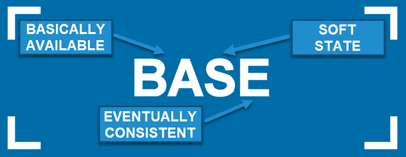

# BASE

## Table of Contents
<!-- TOC -->
* [BASE](#base)
  * [Table of Contents](#table-of-contents)
  * [Basically Available](#basically-available)
  * [Soft State](#soft-state)
  * [Eventually Consistent](#eventually-consistent)
  * [Ref.](#ref)
<!-- TOC -->
---

**BASE** is an acronym that represents a set of properties for distributed and NoSQL databases. It stands for:

## Basically Available

This means that the system is designed to be always available for read and write operations, even in the face of network partitions or hardware failures. Availability is prioritized over consistency in the CAP theorem (Consistency, Availability, Partition tolerance).

## Soft State

The system's state may change over time due to eventual consistency. In other words, there might be a delay between updates in different parts of a distributed system, and during that time, the system's state is considered "soft" or not completely consistent.

## Eventually Consistent

BASE systems prioritize eventual consistency over strong consistency. This means that while data updates might not be immediately reflected across all nodes in a distributed database, they will eventually reach a consistent state. Eventual consistency allows for better availability and fault tolerance, but it can lead to temporary inconsistencies in the data.

>BASE contrasts with the ACID properties (Atomicity, Consistency, Isolation, Durability), which are typically associated with traditional relational databases. 

>ACID databases prioritize strong consistency and transactional integrity, making them suitable for use cases where data consistency is critical, such as financial systems. On the other hand, BASE databases are often used in scenarios where high availability and fault tolerance are more important than immediate consistency, such as web applications, content delivery networks, and social media platforms.

[Back to top](#table-of-contents)

---

## Ref.

- https://www.geeksforgeeks.org/base-properties-in-dbms/
- https://phoenixnap.com/kb/acid-vs-base

---

[Get Started](../../get-started.md) |
[DBMS](../../get-started.md#database-management-systems)

___
