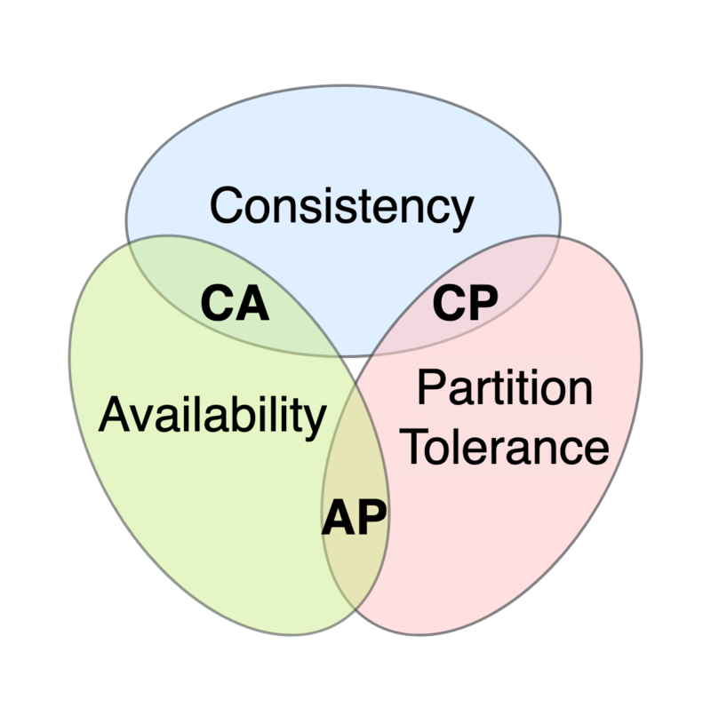

# CAP Theorem

## Table of Contents
<!-- TOC -->
* [CAP Theorem](#cap-theorem)
  * [Table of Contents](#table-of-contents)
  * [Components](#components)
    * [Consistency (C)](#consistency-c)
    * [Availability (A)](#availability-a)
    * [Partition Tolerance (P)](#partition-tolerance-p)
  * [Scenarios](#scenarios-)
    * [CA](#ca)
    * [CP](#cp)
    * [AP](#ap)
  * [Ref.](#ref)
<!-- TOC -->
---

The CAP theorem, also known as Brewer's theorem, is a fundamental principle in distributed computing that addresses the trade-offs involved in designing and operating distributed systems. 

It was formulated by computer scientist Eric Brewer in 2000 and has since become a cornerstone concept for architects and engineers working on distributed systems. 

The theorem states that in a distributed system, there are three key properties: **Consistency**, **Availability**, and **Partition Tolerance**, and _it is impossible for a distributed system to simultaneously guarantee all three to their fullest extent_.

Distributed systems must make trade-offs among these properties based on their specific requirements and use cases.

## Components

- **Consistency**: Every read receives the most recent write or an error.

- **Availability**: Every request receives a (non-error) response, without the guarantee that it contains the most recent write.

- **Partition tolerance**: The system continues to operate despite an arbitrary number of messages being dropped (or delayed) by the network between nodes

### Consistency (C)

Consistency refers to the idea that _all nodes in a distributed system see the same data at the same time_, regardless of which node they query.

- In a consistent system, if a write operation succeeds, all subsequent read operations should reflect that write.
- For this to happen, whenever data is written to one node, it must be instantly forwarded or replicated to all the other nodes in the system before the write is deemed ‘successful.’

> Achieving strong **consistency** often involves coordination and synchronization between nodes, which can introduce latency and reduce system **availability**.

[Back to top](#table-of-contents)

### Availability (A)

Availability means that _every request (read or write) made to the system receives a response_, even if it's not the most up-to-date data.

In an available system, the system remains operational and responsive to user requests, even in the presence of network failures or node crashes.

> Achieving high **availability** may require sacrificing some degree of **consistency**.

[Back to top](#table-of-contents)

### Partition Tolerance (P)

Partition tolerance accounts for the system's ability to continue functioning correctly even in the presence of network partitions or communication failures between nodes.

Network partitions can cause nodes in a distributed system to become isolated, making it impossible for them to communicate with each other.

> A system that is **partition-tolerant** can continue to operate in spite of network disruptions, but this may come at the cost of either **consistency** or **availability**.

[Back to top](#table-of-contents)

## Scenarios    
The CAP theorem asserts that a distributed system can achieve at most two out of the three properties at any given time. This leads to three possible scenarios:

### CA
_A system that prioritizes **Consistency** and **Availability** but is not **Partition-Tolerant**_. 

In other words, it sacrifices partition tolerance for strong consistency and high availability. This approach may work well in scenarios where network partitions are rare and can be quickly resolved.

[Back to top](#table-of-contents)

### CP
_A system that prioritizes **Consistency** and **Partition Tolerance** but may sacrifice **Availability**_. 

In this case, the system ensures data consistency and can tolerate network partitions, but it may become temporarily unavailable during network disruptions.

[Back to top](#table-of-contents)

### AP
_A system that prioritizes **Availability** and **Partition Tolerance** but may sacrifice **Consistency**_. 

This means the system remains available and can tolerate network partitions, even if it means that different nodes may temporarily have slightly inconsistent views of the data.

[Back to top](#table-of-contents)

>It's important to note that the CAP theorem doesn't provide a strict dichotomy; instead, it highlights trade-offs and the need to make design decisions based on the specific requirements and constraints of a distributed system. In practice, many distributed databases and systems aim for a balance between these properties, and various strategies, such as eventual consistency and quorum-based approaches, are used to achieve the desired trade-offs.

---

## Ref.

- https://en.wikipedia.org/wiki/CAP_theorem
- https://www.ibm.com/topics/cap-theorem

---

[Get Started](../../get-started.md) |
[DBMS](../../get-started.md#database-management-systems)

___
