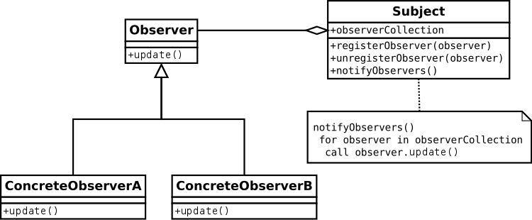

# The Observer Pattern

--- 

## Table of Contents
<!-- TOC -->
* [The Observer Pattern](#the-observer-pattern)
  * [Table of Contents](#table-of-contents)
  * [How It Works](#how-it-works)
  * [Benefits](#benefits)
  * [Example](#example)
  * [Ref.](#ref)
<!-- TOC -->

---

The Observer Pattern is a behavioral design pattern used in software engineering to establish a *one-to-many dependency between objects*. This pattern defines a relationship where when one object (known as the `subject` or `observable`) undergoes a change in its state, all its dependent objects (known as `observers`) are automatically notified and updated accordingly.

The Observer Pattern is particularly useful in scenarios where multiple *objects need to be informed about changes to a certain object's state*, without tightly coupling the objects together. This promotes a more flexible and modular design, allowing changes to one part of the system without affecting other parts.

[Back to top](#table-of-contents)

## How It Works

- **Subject (Observable)**: This is the object that is being observed. It maintains a list of its dependent observers and provides methods to allow observers to subscribe or unsubscribe. The subject also defines a method to notify its observers when its state changes.

- **Observers**: These are the objects that are interested in the state changes of the subject. They register themselves with the subject to receive notifications about changes. When the subject's state changes, it notifies all its observers, typically by invoking a predefined method on each observer.

- **Concrete Subject**: This is a specific implementation of the subject. It holds the actual data and state that observers are interested in. It also triggers the notification to observers when its state changes.

- **Concrete Observers**: These are specific implementations of the observer interface. They define how they should respond to notifications from the subject. Each concrete observer can have its own behavior when it receives an update from the subject.

[Back to top](#table-of-contents)

## Benefits

- **Loose coupling**: The subject and observers are decoupled, meaning that changes to the subject don't necessarily require changes to the observer classes.

- **Extensibility**: New observers can be added without modifying the existing subject or observer classes.

- **Modularity**: Observers can be reused in different contexts with different subjects.

- **Real-time updates**: Observers are automatically notified when the subject's state changes, ensuring up-to-date information.

[Back to top](#table-of-contents)

## Example

Consider a weather monitoring system. The weather station (*subject*) gathers weather data and notifies various displays (*observers*) like a current conditions display, a forecast display, and a statistics display whenever weather conditions change. The displays update themselves based on the received data.

- The weather station (subject) maintains a list of displays (observers) that want to receive weather updates.

- Each display subscribes to the weather station to receive notifications about changes in weather conditions.

- When the weather station's sensors detect a change in weather, it iterates through its list of subscribed displays and notifies each display by invoking the update method, passing relevant weather data.

- Each display, upon receiving the notification, updates its content based on the new weather information.

>In essence, the Observer Pattern facilitates a publish-subscribe mechanism, enabling objects to communicate without being tightly coupled. It promotes a more maintainable and flexible design by separating concerns and allowing for dynamic interaction between objects.

[Back to top](#table-of-contents)

## Ref.

- https://en.wikipedia.org/wiki/Observer_pattern

___

[Get Started](../../../get-started.md) |
[Design Patterns](../../../get-started.md#design-patterns)

___

