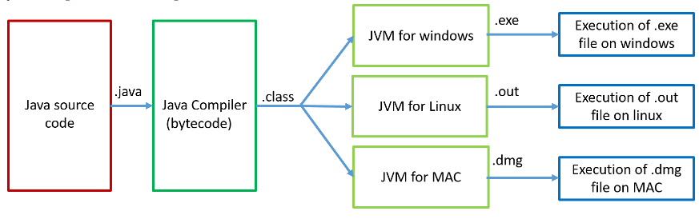

# Java

## Table of Contents
1. [What's Java](#whats-java)
2. [What is Java programming language used for?](#what-is-java-programming-language-used-for)
3. [Whats's OOP?](#whatss-oop)
4. [Whats's WORA?](#whatss-wora)
5. [How is java Multi-plataform?](#how-is-java-multi-plataform)
6. [What is Java Virtual Machine?](#what-is-java-virtual-machine)
7. [How to program in Java?](#how-to-program-in-java)
8. [How is Java versioned?](#how-is-java-versioned)

___

## What's Java?
Java is a programming language and computing platform first released by Sun Microsystems in 1995
Developers as well as users that would like to learn Java programming should visit the dev.java. [^1]

Java is a multi-platform, object-oriented, and network-centric language that can be used as a platform in itself. [^3]

Java is free to download for personal use.
Java is also free for development. [^2]

[Back to top](#table-of-contents)

## What is Java programming language used for?

1. Game Development
2. Cloud computing
3. Big Data
4. Artificial Intelligence
5. Internet of Things
[^3]

[Back to top](#table-of-contents)

## Whats's OOP?
[Object-Oriented Programming (OOP)](../../programming-paradigms/oop.md) is a programming paradigm in computer science that relies on the concept of classes and objects. It is used to structure a software program into simple, reusable pieces of code blueprints (usually called classes), which are used to create individual instances of objects.[^4]

Visit: [Object Oriented Programming](../../programming-paradigms/oop.md)

[Back to top](#table-of-contents)

## Whats's WORA?
WORA, which is abbreviated as Write Once Run Anywhere, is the feature applicable to those programs which hold the capability to execute itself on any operating systems or any machine. Sun Microsystem gave this terminology for their programming language - Java. [^6]

[Back to top](#table-of-contents)

## How is java Multi-plataform?
When we compile java source code using java compiler, it generates .class file which is nothing but the bytecode. The bytecode is platform independent and bytecode is only understandable to JVM and not the windows, Linux, Mac OS, etc. [^7]

Java allows run Java bytecode on any computer irrespective of the machine or the hardware, using JVM (Java Virtual Machine). The bytecode generated by the compiler is not platform-specific and hence takes the help of JVM to run on a wide range of machines. [^6]

[Back to top](#table-of-contents)

## What is Java Virtual Machine?
The Java Virtual Machine acts as an additional abstraction layer between the Java platform and the underlying machine hardware. Java source code can run only on those machines that have JVM installed on them. [^3]

JVM is basically responsible for converting .class or bytecode into platform specific executable file which is shown below. [^7]

[Back to top](#table-of-contents)

## How to program in Java?
To begin programming in Java, you need to install a Java Edition on your system. There are four main Java editions:

 - Java Standard Edition (Java SE)
 - Java Enterprise Edition (Java EE)
 - Java Micro Edition (Java ME)
 [^3]

[Back to top](#table-of-contents)

## How is Java versioned?
The Java language has undergone [several changes since JDK 1.0](versions.md) as well as numerous additions of classes and packages to the standard library.
Regarding Oracle Java SE Support Roadmap, version 20 is the latest one, and versions 17, 11 and 8 are the currently supported long-term support (LTS) versions
Regarding Oracle Java SE Support Roadmap, version 20 is the latest one, and versions 17, 11 and 8 are the currently supported long-term support (LTS) versions. [^8]
- Visit: [Main Java Version Changes](versions.md)

[Back to top](#table-of-contents)

___

[Index](../../common/table-of-contents.md) |
[Back to top](#table-of-contents)

___
### Ref.

[^1]: https://www.java.com/en/download/help/whatis_java.html
[^2]: https://www.oracle.com/java/
[^3]: https://aws.amazon.com/what-is/java/?nc1=h_ls
[^4]: https://www.educative.io/blog/object-oriented-programming
[^6]: https://www.w3schools.in/java/questions-answers/write-once-run-anywhere-wora
[^7]: https://bytesofgigabytes.com/java/why-java-is-platform-independent/
[^8]: https://en.wikipedia.org/wiki/Java_version_history

