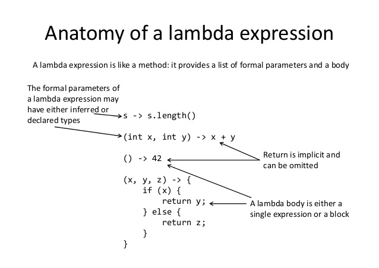

# Lambda Expression

---

## Table of Contents
<!-- TOC -->
* [Lambda Expression](#lambda-expression)
  * [Table of Contents](#table-of-contents)
  * [Introduction](#introduction)
  * [Examples](#examples)
    * [Lambda Expression Syntax](#lambda-expression-syntax)
    * [Lambda Listener](#lambda-listener)
    * [Lambda Capture](#lambda-capture)
    * [Lambda Inference](#lambda-inference)
  * [Ref.](#ref)
<!-- TOC -->

___

## Introduction

Before Java 8, whenever you wanted to instantiate, for example, a new Runnable, you had to write an anonymous inner class like so:

```java
Runnable runnable = new Runnable(){
    @Override
    public void run(){
        System.out.println("Hello world !");
    }
};
```

With lambdas, the same code looks like this:
```java
Runnable runnable = () -> System.out.println("Hello world two!");
```

 
[^1]

- See also [FP in Java](../fp.md)

---

## Examples

1. [Lambda Expression Syntax](#lambda-expression-syntax)
2. [Lambda Listener](#lambda-listener)
3. [Lambda Capture](#lambda-capture)
4. [Lamdbda Inference](#lambda-inference)

___

### Lambda Expression Syntax

Overall, the code aims to illustrate how lambda expressions can simplify the implementation of functional interfaces and make the code more readable and concise.

The code defines a Comparator interface for comparing Employee objects based on their names. It starts with a traditional anonymous class implementation and then converts it into lambda expressions in several steps.

```java
    // old fashion anonymous class implementation
    Comparator<Employee> byName = new Comparator<Employee>() {
        @Override
        public int compare(Employee a, Employee b) {
            return a.getName().compareTo(b.getName());
        }
    };

    // First lambda expression
    Comparator<Employee> byNameLambda1 =
    (Employee a, Employee b) -> {return a.getName().compareTo(b.getName()); };

    // Removing parameter types
    Comparator<Employee> byNameLambda2 =
    (a,b) -> { return a.getName().compareTo(b.getName()); };

    // Removing braces and return
    Comparator<Employee> byNameLambda3 =
    (a,b) -> a.getName().compareTo(b.getName());
```

The code also demonstrates the usage of lambda expressions with the Runnable interface. It creates multiple Thread instances using lambda expressions to define the behavior of the thread.

```java
    Thread t1 = new Thread(r);

    // No need to even mention Runnable
    Thread t2 = new Thread(() -> {
        System.out.println("An implicit Runnable");
    });
    
    // No need for braces here
    Thread t3 = new Thread(() -> System.out.println("An implicit Runnable!"));
```

Lastly, the code showcases a lambda expression with a single parameter using the Consumer functional interface. It defines a Consumer that takes a String and prints its length.

```java
    // Expression with one parameter
    Consumer<String> lengthPrinter =
            s -> System.out.println(s.length());
```

<sub>[View on Github](https://github.com/ggranados/java/blob/master/FunctionalProgramming/src/org/linkedinlearning/functionalprogramming/lambda/LambdaExpressionSyntax.java)</sub> |
<sub>[Back to top](#table-of-contents)</sub>


___


### Lambda Listener

This Java code demonstrates the usage of anonymous classes and lambda expressions in the context of Swing GUI programming.

Creates a simple Swing GUI window with two text fields and two buttons. Clicking the "Say Hello" button updates the text fields with "Hello, world!" using an anonymous class. 

```java
    // For this we use a regular anonymous class
    helloButton.addActionListener(new ActionListener() {
        @Override
        public void actionPerformed(ActionEvent e) {
            staticTextField.setText("Hello, world!");
            localTextField.setText("Hello, world");
        }
    });
```

Clicking the "Say Goodbye" button updates the text fields with "Goodbye, world!" using a lambda expression.

```java
    // For this we use a lambda expression (actually, block)
    JButton goodbyeButton = new JButton("Say Goodbye");
    goodbyeButton.addActionListener( event -> {
        staticTextField.setText("Goodbye, world!");
        localTextField.setText("Goodbye, world");
    });
```

<sub>[View on Github](https://github.com/ggranados/java/blob/master/FunctionalProgramming/src/org/linkedinlearning/functionalprogramming/lambda/LambdaListener.java)</sub> |
<sub>[Back to top](#table-of-contents)</sub>


---

### Lambda Capture

By capturing variables from their surrounding scope, lambda expressions provide convenient access to those variables without explicitly passing them as parameters. The type of capturing (non-capturing, instance-capturing, or constant-capturing) determines which variables are accessible within the lambda expression.

Non-capturing Lambda Expression:
A non-capturing lambda expression does not capture (or access) any variables from its surrounding scope. It directly uses the parameters or constants defined within the lambda expression itself.

```java
    // Non-capturing lambda, one instance
    System.out.println("\nNon-capturing lambda:");
    for (int i=0; i<5; i++) {
        Consumer<String> myPrinter2 =
                msg -> System.out.println("Consuming " + msg);

        myPrinter2.accept(myPrinter2.toString());
    }
```

Instance-Capturing Lambda Expression:
An instance-capturing lambda expression captures (or accesses) instance variables from the enclosing class. These variables belong to the object on which the lambda expression is invoked.

```java
    // Constant-capturing lambda, one instance
    System.out.println("\nConstant-capturing lambda:");
    final int secret = 42;
    for (int i = 0; i < 5; i++) {
        Consumer<String> myPrinter3 =
                msg -> System.out.println("Consuming " + msg + ", " + secret);

        myPrinter3.accept(myPrinter3.toString());
		}
```

Constant-Capturing Lambda Expression:
A constant-capturing lambda expression captures (or accesses) final or effectively final variables from the surrounding scope. These variables are treated as constants because their values do not change after they are assigned.

```java
    private int id = 1;
    public void foo() {
        System.out.println("\nInstance-capturing lambda:");
    
        for (int i=0; i<5; i++) {
            // this-capturing lambda, many instances!
            Consumer<String> myPrinter4 =
                    msg -> System.out.println("Consuming " + msg + ", " + id);
    
            myPrinter4.accept(myPrinter4.toString());
        }
    }
```

<sub>[View on Github](https://github.com/ggranados/java/blob/master/FunctionalProgramming/src/org/linkedinlearning/functionalprogramming/lambda/LambdaCapture.java)</sub> |
<sub>[Back to top](#table-of-contents)</sub>

___

### Lambda Inference

This Java code demonstrates the inference rules for lambda expressions and shows different scenarios related to type inference.

a. The first lambda expression `Consumer<String> c1 = msg -> System.out.println(msg.length());` showcases the standard syntax for lambda expressions. The type of the lambda expression parameter (msg) is inferred based on the expected type of the Consumer interface, which is String in this case.

```java
    // Standard syntax
    Consumer<String> c1 = msg -> System.out.println(msg.length());
```

b. The second and third examples (`Object x1` and `Object x2`) intentionally cause compile-time errors. They show situations where there is not enough information available for the compiler to infer the type of the lambda expression parameter. In these cases, explicit type information is needed to resolve the error.

```java
    // Compile-time error: not enough info
    Object x1 = msg -> System.out.println(msg.length());

    //Compile-time error: not enough info
    Object x2 = (String msg) -> System.out.println(msg.length());

```

c. The fourth example `Object x3 = (Consumer<String>)((String msg) -> System.out.println(msg.length()));` resolves the compile-time error by explicitly casting the lambda expression to the `Consumer<String>` type. By providing the explicit cast, the compiler can determine the type of the lambda expression parameter.

```java
    // Ok: cast added
    Object x3 = (Consumer<String>)((String msg) -> System.out.println(msg.length()));
```

d. The fifth and sixth examples demonstrate scenarios where the inferred type is Object due to the use of wildcard (?). 
In the case of `Consumer<?> c2 = msg -> System.out.println(msg);` the inferred type is Object because the wildcard does not provide specific type information. 

```java
    //OK: but inferred type is Object
    Consumer<?> c2 = msg -> System.out.println(msg);

```

The same applies to `Consumer<?> c4 = (String msg) -> System.out.println(msg.length());` where the explicit manifest type (String) is added to the parameter.

```java
    // Ok: added manifest type to parameter
    Consumer<?> c4 = (String msg) -> System.out.println(msg.length());
```

e. The commented line `Consumer<?> c3 = msg -> System.out.println(msg.length());` causes a compile-time error. It demonstrates that type inference is not based on the body of the lambda expression. Even though the body of the lambda expression uses msg.length(), the type inference does not consider it when determining the type of the lambda expression parameter.

```java
    //Compile-time error: Inference is *not* based on body of lambda
    Consumer<?> c3 = msg -> System.out.println(msg.length());
```

<sub>[View on Github](https://github.com/ggranados/java/blob/master/FunctionalProgramming/src/org/linkedinlearning/functionalprogramming/lambda/LambdaInference.java)</sub> |
<sub>[Back to top](#table-of-contents)</sub>

___

## Ref.

- https://www.oracle.com/webfolder/technetwork/tutorials/obe/java/Lambda-QuickStart/index.html#section2
- https://blogs.oracle.com/javamagazine/post/quiz-yourself-lambda-types-advanced
- https://blogs.oracle.com/javamagazine/post/java-quiz-nested-lambdas

  [^1]: https://lifebeginsatfortyblog.wordpress.com/2016/07/01/the-java-tutorials-lambda-expressions/

___


[Get Started](../../../../../get-started.md) |
[PF in Java](../versions.md#java-8-lts) |
[Java 8](../versions.md#java-8-lts) |
[Java Development](../develop.md#lambdas-and-functional-interfaces)

___