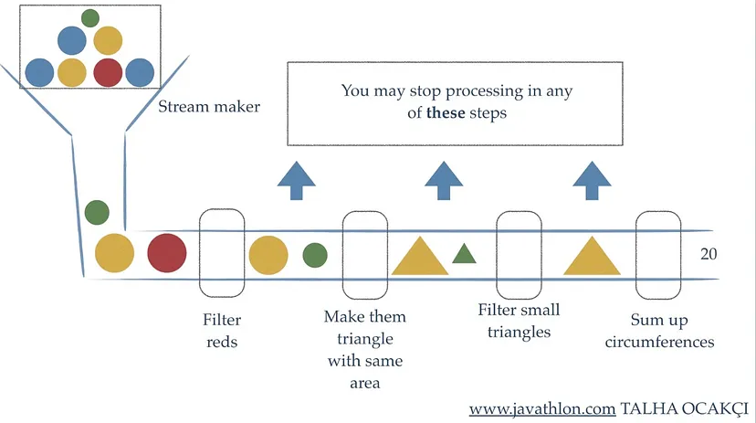
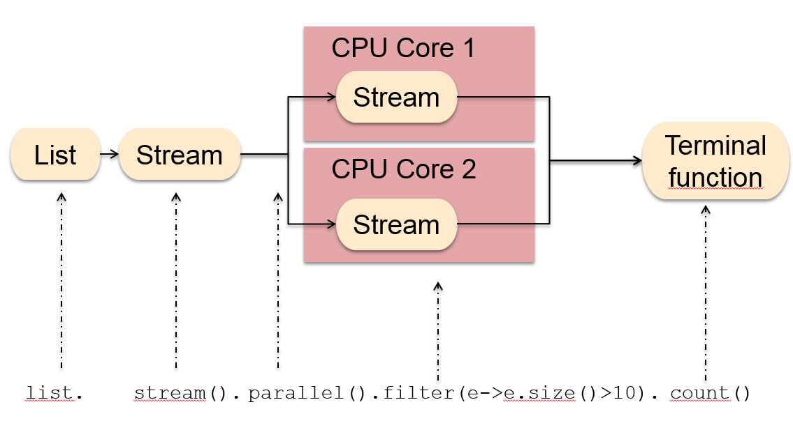
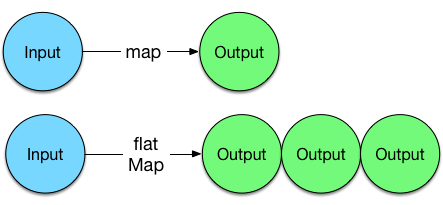

# Streams

---

## Table of Contents
<!-- TOC -->
* [Streams](#streams)
  * [Table of Contents](#table-of-contents)
  * [Overview](#overview)
  * [Streams internally](#streams-internally)
  * [Stream Operations](#stream-operations)
    * [Source of Streams](#source-of-streams)
    * [Intermediate Operations](#intermediate-operations-)
      * [Map](#map)
      * [Filter](#filter)
      * [Distinct](#distinct)
      * [Sorted](#sorted)
      * [Limit](#limit)
      * [Skip](#skip)
      * [FlatMap](#flatmap)
    * [Terminal Operations](#terminal-operations)
      * [forEach](#foreach)
      * [toArray](#toarray)
      * [reduce](#reduce)
      * [collect](#collect)
      * [count](#count)
  * [Infinite Streams](#infinite-streams)
      * [Infinite Stream using Stream.generate](#infinite-stream-using-streamgenerate)
      * [Infinite Stream using Stream.iterate](#infinite-stream-using-streamiterate)
  * [Parallel Streams](#parallel-streams)
  * [Optional](#optional)
  * [Examples](#examples)
    * [Convert List of objects to another List of objects](#convert-list-of-objects-to-another-list-of-objects)
    * [Create new list by filtering elements in List](#create-new-list-by-filtering-elements-in-list)
    * [Find element from a List by property of element](#find-element-from-a-list-by-property-of-element)
    * [Find maximum and minimum number from List of Integers](#find-maximum-and-minimum-number-from-list-of-integers)
    * [Get sum of integers in using reduce operation](#get-sum-of-integers-in-using-reduce-operation)
  * [Ref.](#ref)
<!-- TOC -->


## Overview

In Java, a Stream is a sequence of elements that supports functional-style operations to perform computations on those elements. 

It represents a pipeline of data that can be processed in a declarative and functional manner. 

Streams provide a higher-level abstraction for working with collections, arrays, and other data sources without the need for explicit iteration.


## Streams internally

Key characteristics of a Stream and how it operates internally:

- **Laziness**: Streams are designed to be lazy, meaning that the operations are not executed until a _terminal operation_ is called. _Intermediate operations_, such as filter, map, and sorted, only define the data transformation steps but do not start processing the elements immediately. This laziness allows for optimization and avoids unnecessary computations.


- **Pipeline**: When you perform multiple operations on a Stream, you create a pipeline. Each operation is connected to the previous one, forming a _chain of transformations_. These operations are executed in the order they are defined when a _terminal operation_ is called, allowing for a step-by-step data transformation process.



- **Internal Iteration**: Unlike traditional iteration using loops, Streams use internal iteration. This means that the Stream implementation takes care of iterating through the data source for you. This internal iteration enables better _optimization_ and, in some cases, _parallelization_.


- **Immutability**: Streams are designed to be immutable, which means that the original _data source remains unchanged_ throughout the Stream processing. Instead of modifying the data in place, Stream operations _produce new Streams_ with the transformed data.


- **Short-circuiting**: Some Stream operations, like `findFirst`, `findAny`, `anyMatch`, and `allMatch`, have short-circuiting behavior. This means that they may not need to process all elements in the Stream to produce a result. For example, findFirst will stop processing once it finds the first matching element.


- **Parallel processing**: The Stream API supports parallel processing, allowing the Stream to be divided into multiple segments that can be processed concurrently on multiple threads. This can lead to performance improvements when working with large datasets.


<sub>[Back to top](#table-of-contents)</sub>

## Stream Operations

Order of operations on stream should be:

1. Source of Stream
2. Zero/more intermediate operations
3. Terminal operation


<sub>[Back to top](#table-of-contents)</sub>

### Source of Streams

In Java, there are several ways to create or obtain streams:

- **From a Collection**:

You can create a stream from a collection, such as a List, Set, or other data structures.

```java
import java.util.ArrayList;
import java.util.List;
import java.util.stream.Stream;

public class StreamCreationDemo {

    public static void main(String[] args) {
        List<String> fruits = new ArrayList<>();
        fruits.add("Apple");
        fruits.add("Banana");
        fruits.add("Orange");

        // Creating a stream from the List
        Stream<String> streamFromList = fruits.stream();

        // Displaying elements in the stream
        streamFromList.forEach(System.out::println);
    }
}
```

<sub>[Back to top](#table-of-contents)</sub>


- **From an Array**:
You can create a stream from an array of elements.

```java
import java.util.stream.Stream;

public class StreamCreationDemo {

    public static void main(String[] args) {
        String[] fruits = {"Apple", "Banana", "Orange"};

        // Creating a stream from the array
        Stream<String> streamFromArray = Stream.of(fruits);

        // Displaying elements in the stream
        streamFromArray.forEach(System.out::println);
    }
}
```

<sub>[Back to top](#table-of-contents)</sub>

- **From a Stream Builder**:
You can use a Stream Builder to build a stream by adding elements to it.

```java
import java.util.stream.Stream;

public class StreamCreationDemo {

    public static void main(String[] args) {
        Stream.Builder<String> streamBuilder = Stream.builder();

        // Adding elements to the stream builder
        streamBuilder.add("Apple");
        streamBuilder.add("Banana");
        streamBuilder.add("Orange");

        // Building the stream
        Stream<String> builtStream = streamBuilder.build();

        // Displaying elements in the stream
        builtStream.forEach(System.out::println);
    }
}
```

<sub>[Back to top](#table-of-contents)</sub>


- **From a Stream of Strings**:
Java provides a utility method to create a stream of strings.

```java
import java.util.stream.Stream;

public class StreamCreationDemo {

    public static void main(String[] args) {
        // Creating a stream of strings
        Stream<String> stringStream = Stream.of("Apple", "Banana", "Orange");

        // Displaying elements in the stream
        stringStream.forEach(System.out::println);
    }
}

```

<sub>[Back to top](#table-of-contents)</sub>


- **From a Stream of Primitive Types**:
You can create streams of primitive data types, like int, long, or double.

```java
import java.util.stream.IntStream;

public class StreamCreationDemo {

    public static void main(String[] args) {
        // Creating a stream of ints
        IntStream intStream = IntStream.of(1, 2, 3, 4, 5);

        // Displaying elements in the stream
        intStream.forEach(System.out::println);
    }
}
```

<sub>[Back to top](#table-of-contents)</sub>

- **From a File**:
You can create a stream from the lines of a file.

```java
import java.io.IOException;
import java.nio.file.Files;
import java.nio.file.Paths;
import java.util.stream.Stream;

public class StreamCreationDemo {

    public static void main(String[] args) {
        String filePath = "path/to/your/file.txt";

        try {
            // Creating a stream from lines of the file
            Stream<String> fileStream = Files.lines(Paths.get(filePath));

            // Displaying lines from the file
            fileStream.forEach(System.out::println);

            // Don't forget to close the stream after use (not required for other types of streams)
            fileStream.close();
        } catch (IOException e) {
            e.printStackTrace();
        }
    }
}
```

<sub>[Back to top](#table-of-contents)</sub>

### Intermediate Operations 

These intermediate operations return a new stream, which can be further processed or terminated with terminal operations. Here are some of the main intermediate operations in Java 8 streams:

<sub>[Back to top](#table-of-contents)</sub>

#### Map
Transforms each element of the stream into another object.

```java
import java.util.Arrays;
import java.util.List;
import java.util.stream.Stream;

public class IntermediateOperationsDemo {

    public static void main(String[] args) {
        List<String> fruits = Arrays.asList("Apple", "Banana", "Orange");

        // Using map to convert each fruit to uppercase
        Stream<String> uppercaseStream = fruits.stream()
                .map(String::toUpperCase);

        // Displaying transformed elements
        uppercaseStream.forEach(System.out::println);
    }
}
```

Output:

```
APPLE
BANANA
ORANGE
```

<sub>[Back to top](#table-of-contents)</sub>

#### Filter
Filters elements based on a specified condition.

```java
import java.util.Arrays;
import java.util.List;
import java.util.stream.Stream;

public class IntermediateOperationsDemo {

    public static void main(String[] args) {
        List<String> fruits = Arrays.asList("Apple", "Banana", "Orange");

        // Using filter to get only fruits with more than 5 letters
        Stream<String> filteredStream = fruits.stream()
                .filter(fruit -> fruit.length() > 5);

        // Displaying filtered elements
        filteredStream.forEach(System.out::println);
    }
}
```

Output:

```
Banana
Orange
```

<sub>[Back to top](#table-of-contents)</sub>

#### Distinct
Removes duplicates from the stream.

```java
import java.util.Arrays;
import java.util.List;
import java.util.stream.Stream;

public class IntermediateOperationsDemo {

    public static void main(String[] args) {
        List<String> fruits = Arrays.asList("Apple", "Banana", "Orange", "Apple");

        // Using distinct to remove duplicates
        Stream<String> distinctStream = fruits.stream()
                .distinct();

        // Displaying distinct elements
        distinctStream.forEach(System.out::println);
    }
}
```

Output:

```
APPLE
BANANA
ORANGE
```

<sub>[Back to top](#table-of-contents)</sub>

#### Sorted
Sorts the elements of the stream based on natural order or a specified comparator.

```java
import java.util.Arrays;
import java.util.List;
import java.util.stream.Stream;

public class IntermediateOperationsDemo {

    public static void main(String[] args) {
        List<String> fruits = Arrays.asList("Orange", "Apple", "Banana");

        // Using sorted to sort the elements
        Stream<String> sortedStream = fruits.stream()
                .sorted();

        // Displaying sorted elements
        sortedStream.forEach(System.out::println);
    }
}
```

Output:

```
Apple
Banana
Orange

```

<sub>[Back to top](#table-of-contents)</sub>

#### Limit
Limits the number of elements in the stream.

```java
import java.util.stream.Stream;

public class IntermediateOperationsDemo {

    public static void main(String[] args) {
        // Using limit to get only the first 2 elements
        Stream<Integer> numberStream = Stream.iterate(1, n -> n + 1)
                .limit(2);

        // Displaying limited elements
        numberStream.forEach(System.out::println);
    }
}
```

Output:

```
1
2
```

<sub>[Back to top](#table-of-contents)</sub>

#### Skip
Skips the specified number of elements from the stream.

```java
import java.util.stream.Stream;

public class IntermediateOperationsDemo {

    public static void main(String[] args) {
        // Using skip to skip the first 2 elements
        Stream<Integer> numberStream = Stream.iterate(1, n -> n + 1)
                .skip(2)
                .limit(5);

        // Displaying elements after skipping
        numberStream.forEach(System.out::println);
    }
}
```

Output:

```
3
4
5
6
7
```

<sub>[Back to top](#table-of-contents)</sub>

#### FlatMap
Flattens nested collections and maps each element to a stream, then concatenates the resulting streams into a single stream.

```java
import java.util.Arrays;
import java.util.List;
import java.util.stream.Stream;

public class IntermediateOperationsDemo {

    public static void main(String[] args) {
        List<List<String>> nestedFruits = Arrays.asList(
                Arrays.asList("Apple", "Banana"),
                Arrays.asList("Orange", "Mango")
        );

        // Using flatMap to flatten the nested lists
        Stream<String> flattenedStream = nestedFruits.stream()
                .flatMap(List::stream);

        // Displaying flattened elements
       
        flattenedStream.forEach(System.out::println);
    }
}
```

Output:

```
Apple
Banana
Orange
Mango
```

FlatMap is a function that receives one input and returns several outputs for that input. That is the difference with Map which has one input and returns a single output.



<sub>[Back to top](#table-of-contents)</sub>

### Terminal Operations
A terminal operation is an operation that ends the processing of a stream and produces a final result. 

Once a terminal operation is applied to a stream, it triggers the actual computation of the stream pipeline, executing all the intermediate operations (such as filtering, mapping, etc.) that were chained before the terminal operation.

A few important characteristics of terminal operations are:

- **Non-interfering**: Terminal operations *do not modify the underlying data source* (e.g., collections) in any way. They only produce a result based on the elements of the stream.

- **Stateless/Idempotent**: Terminal operations *do not maintain any state between elements*. Each element is processed independently, and the result is solely based on the elements themselves.

- **Eager evaluation**: Terminal operations are eager, meaning they *process all the elements* in the stream once they are invoked. This is in contrast to intermediate operations, which are lazy and do not perform any computation until a terminal operation is called.

- **One-time use**: Once a terminal operation is applied to a stream, the *stream is considered consumed and cannot be used again*. If you need to perform another operation on the same data source, you will need to create a new stream.

Examples of terminal operations include forEach, toArray, reduce, collect, count, min, max, anyMatch, allMatch, noneMatch, etc.

<sub>[Back to top](#table-of-contents)</sub>


#### forEach
This terminal operation allows you to perform an action on each element of the stream.

```java
import java.util.Arrays;
import java.util.List;

public class StreamDemo {
    public static void main(String[] args) {
        List<String> fruits = Arrays.asList("Apple", "Banana", "Orange", "Mango");

        // Using forEach to print each element of the stream
        fruits.stream()
              .forEach(fruit -> System.out.println(fruit));
    }
}
```

Output:
```
Apple
Banana
Orange
Mango
```

<sub>[Back to top](#table-of-contents)</sub>


#### toArray
This terminal operation collects the elements of the stream into an array.

```
import java.util.Arrays;
import java.util.List;

public class StreamDemo {
  public static void main(String[] args) {
       List<String> fruits = Arrays.asList("Apple", "Banana", "Orange", "Mango");

        // Using toArray to collect the elements into an array
        String[] fruitArray = fruits.stream()
                                   .toArray(String[]::new);

        // Printing the elements of the array
        Arrays.stream(fruitArray)
              .forEach(fruit -> System.out.println(fruit));
    }
}
```

Output:

```
Apple
Banana
Orange
Mango
```

<sub>[Back to top](#table-of-contents)</sub>


#### reduce
This terminal operation combines the elements of the stream into a single result using a binary operator.


```
import java.util.Arrays;
import java.util.List;

public class StreamDemo {
    public static void main(String[] args) {
      List<Integer> numbers = Arrays.asList(1, 2, 3, 4, 5);

      // Using reduce to calculate the sum of elements in the stream
      int sum = numbers.stream()
                       .reduce(0, (a, b) -> a + b);

      System.out.println("Sum: " + sum);
    }
}
```

```
Sum: 15
```

<sub>[Back to top](#table-of-contents)</sub>

#### collect
This terminal operation gathers the elements of the stream into a collection, such as a list, set, or map.

```
import java.util.Arrays;
import java.util.List;
import java.util.stream.Collectors;

public class StreamDemo {
  public static void main(String[] args) {
      List<String> fruits = Arrays.asList("Apple", "Banana", "Orange", "Mango");

      // Using collect to create a list of filtered elements
      List<String> filteredFruits = fruits.stream()
                                         .filter(fruit -> !fruit.equals("Orange"))
                                         .collect(Collectors.toList());

      System.out.println(filteredFruits);
    }
}
```

Output:

```
[Apple, Banana, Mango]
```

<sub>[Back to top](#table-of-contents)</sub>


#### count
This terminal operation counts the number of elements in the stream.

```
import java.util.Arrays;
import java.util.List;

public class StreamDemo {
  public static void main(String[] args) {
    List<String> fruits = Arrays.asList("Apple", "Banana", "Orange", "Mango");

      // Using count to get the number of elements in the stream
      long count = fruits.stream()
                         .count();

      System.out.println("Number of fruits: " + count);
    }
}
```

Output:

```
Number of fruits: 4
```

<sub>[Back to top](#table-of-contents)</sub>

## Infinite Streams

In Java 8, you can create infinite streams and use the `iterate` method to generate streams with a specific pattern or sequence. 

Let's explore examples of both infinite streams and the iterate method:

#### Infinite Stream using Stream.generate

Infinite streams can be generated using the `Stream.generate` method, which takes a `Supplier` to generate elements for the stream. Since this stream is infinite, you need to use terminal operations like `limit` to restrict the number of elements you want to process.

```java
import java.util.stream.Stream;

public class InfiniteStreamDemo {
  public static void main(String[] args) {
// Generating an infinite stream of random numbers
    Stream.generate(Math::random)
            .limit(5) // Limiting the stream to 5 elements
            .forEach(System.out::println);
  }
}
```

One possible output:

```
0.14819354356741987
0.25997602007581033
0.29309631791811275
0.6865674783219079
0.5237573769274322
```

<sub>[Back to top](#table-of-contents)</sub>

#### Infinite Stream using Stream.iterate

The `Stream.iterate` method allows you to create an infinite sequential stream, where each element is generated based on the previous element using a function (`UnaryOperator`).

```
import java.util.stream.Stream;

public class IterateStreamDemo {
  public static void main(String[] args) {
    // Generating an infinite stream of even numbers starting from 2
    Stream.iterate(2, n -> n + 2)
      .limit(5) // Limiting the stream to 5 elements
      .forEach(System.out::println);
  }
}
```

Output:

```
2
4
6
8
10
```


In this example, we create an infinite stream of even numbers starting from 2. The `Stream.iterate` method takes the initial value (2) and applies the lambda function `n -> n + 2` to generate the next element in the stream (i.e., 2 + 2, 4 + 2, and so on). We then limit the stream to 5 elements using the `limit` method before printing them.

>Remember that when dealing with infinite streams, it's crucial to apply a terminal operation (`like` `limit`, `findFirst`, etc.) to make the stream finite and avoid running indefinitely.

<sub>[Back to top](#table-of-contents)</sub>

## Parallel Streams

In Java 8, parallel streams provide a convenient way to perform operations on collections concurrently, taking advantage of multiple cores in modern processors. Parallel streams automatically divide the data into multiple chunks and process them in parallel, potentially speeding up the computation for large datasets.

To use parallel streams in Java 8, you can simply call the `parallel()` method on a stream or use the `parallelStream()` method directly on a collection. Let's demonstrate the concept of parallel streams with a simple example:

Suppose we have a list of integers and want to find the sum of all the elements using both regular and parallel streams to compare the performance.

```java
import java.util.Arrays;
import java.util.List;

public class ParallelStreamDemo {
    public static void main(String[] args) {
        List<Integer> numbers = Arrays.asList(1, 2, 3, 4, 5, 6, 7, 8, 9, 10);

        // Using a regular stream to calculate the sum
        long startRegular = System.currentTimeMillis();
        int sumRegular = numbers.stream()
                               .mapToInt(Integer::intValue)
                               .sum();
        long endRegular = System.currentTimeMillis();

        System.out.println("Sum using regular stream: " + sumRegular);
        System.out.println("Time taken using regular stream: " + (endRegular - startRegular) + "ms");

        // Using a parallel stream to calculate the sum
        long startParallel = System.currentTimeMillis();
        int sumParallel = numbers.parallelStream()
                                .mapToInt(Integer::intValue)
                                .sum();
        long endParallel = System.currentTimeMillis();

        System.out.println("Sum using parallel stream: " + sumParallel);
        System.out.println("Time taken using parallel stream: " + (endParallel - startParallel) + "ms");
    }
}
```

Output:
```
Sum using regular stream: 55
Time taken using regular stream: 3ms
Sum using parallel stream: 55
Time taken using parallel stream: 2ms
```

Note that the actual performance gain from parallel streams depends on the size of the dataset and the complexity of the operations being performed. For small datasets or simple operations, the overhead of dividing the data and managing parallelism might outweigh the benefits. However, for large datasets or computationally intensive operations, parallel streams can provide significant performance improvements.

Keep in mind that parallel streams can be useful for certain scenarios, but they are not a one-size-fits-all solution.

<sub>[Back to top](#table-of-contents)</sub>


## Optional

In Java 8, Optional is a *container class* that represents an optional value. It is used to handle situations *where a value may or may not be present*, avoiding the need to deal with `null` values directly. 

>Optional provides a more explicit and safer way to handle the absence of values, reducing the possibility of `NullPointerExceptions` in your code.

Here's a brief description of how Optional works:

- **Creation of Optional**: You can create an Optional instance using the `of`, `ofNullable`, or empty static methods of the `Optional` class.

- **Checking the Presence of Value**: You can check if an `Optional` contains a value using the `isPresent()` method or use the more expressive method `ifPresent(Consumer<? super T> consumer)` to perform an action if the value is present.

- **Retrieving the Value**: You can extract the value from an `Optional` using the `get()` method. However, it is generally recommended to use other methods like `orElse`, `orElseGet`, or `orElseThrow` to provide default values or handle the absence of a value gracefully.

- **Chaining Operations**: You can chain multiple operations on an Optional using methods like `map`, `flatMap`, and `filter`, similar to working with streams.

Let's demonstrate the use of Optional with a simple example:

Suppose we have a method that searches for a book in a library and returns an Optional to handle the case where the book may or may not be found.

```java
import java.util.Optional;

public class OptionalDemo {
  public static void main(String[] args) {
    // Simulating a book search, where the book may or may not be found
    Optional<String> book = findBook("Java 8 in Action");

    // Using isPresent() to check if the book is found
    if (book.isPresent()) {
      System.out.println("Book found: " + book.get());
    } else {
      System.out.println("Book not found.");
    }

    // Using ifPresent() to perform an action if the book is found
    book.ifPresent(b -> System.out.println("Book found: " + b));

    // Using orElse() to provide a default value if the book is not found
    String result = book.orElse("Java: The Complete Reference");
    System.out.println("Book result: " + result);
  }

  // Method to simulate book search (returning an Optional)
  public static Optional<String> findBook(String title) {
    // In this example, let's assume the book is found in the library
    return Optional.of(title);
  }
}
```

Output:

```
Book found: Java 8 in Action
Book found: Java 8 in Action
Book result: Java 8 in Action
```

In this example, the findBook method returns an `Optional` containing the book title if the book is found, or an empty `Optional` if the book is not found. We then demonstrate various methods provided by Optional to handle the presence or absence of the book title.


<sub>[Back to top](#table-of-contents)</sub>

## Examples

### Convert List of objects to another List of objects

Below example creates List of String from List of Person object by using name property of Person.

```java
List<Person> persons = new ArrayList<>();
persons.add(new Person("Bytes", 18));
persons.add(new Person("Tree", 20));
persons.add(new Person("Streams", 22));

List<String> names = persons.stream()
        .map(p -> p.getName())
        .collect(Collectors.toList());

System.out.println(names);
```

The map operation is applied to the Stream. The map operation transforms each element of the Stream into a new element. In this case, we map each Person object to its name using a lambda expression `p -> p.getName()`. The `getName()` method retrieves the name of the Person object.

After the map operation, we have a Stream of String elements (the names of the persons).

Finally, we use the collect terminal operation to gather the Stream elements into a new List. We use `Collectors.toList()` as the collector, which creates a new List containing all the elements of the Stream.

Output:

```
[Bytes, Tree, Streams]
```

<sub>[Back to top](#table-of-contents)</sub>


### Create new list by filtering elements in List

Below example filters even numbers from List of integers and put them in a new List.

```java
//create list of integers from 1 to 10
List<Integer> numbers = Stream
        .iterate(1, n -> n + 1)
        .limit(10)
        .collect(Collectors.toList());

List<Integer> evenNumbers = numbers.stream()
        .filter(n -> (n.intValue() % 2 == 0))
        .collect(Collectors.toList());

System.out.println(evenNumbers);
```

We create a Stream of integers called numbers using the Stream.iterate method. 

After applying the limit operation, we have a Stream containing the first 10 natural numbers.

We collect the elements of the numbers stream into a new List<Integer>


The filter intermediate operation is applied to the numbers stream. It retains only the elements that satisfy if the element is even (divisible by 2) using the expression `n -> (n.intValue() % 2 == 0)`.

After the filter operation, we have a Stream containing only the even numbers from the original numbers list.

We collect the elements of the numbers stream, which now contains only even numbers, into the evenNumbers list using the collect terminal operation with Collectors.toList().

Finally, we print the evenNumbers.

Output:

```
[2, 4, 6, 8, 10]
```

<sub>[Back to top](#table-of-contents)</sub>


### Find element from a List by property of element

```java
List<Person> persons = new ArrayList<>();
persons.add(new Person("Bytes", 18));
persons.add(new Person("Tree", 20));
persons.add(new Person("Streams", 22));

Optional<Person> result = persons.stream()
        .filter(p -> p.getName().equals("Bytes"))
        .findAny();

if (result.isPresent()) {
    System.out.println(result.get());
} else {
    System.out.println("Not Found");
}
```

The filter operation is applied to the Stream. The filter operation takes a lambda function that specifies a condition.  It retains only the elements whose name is "Bytes" using the expression `p -> p.getName().equals("Bytes")`.

After the filter operation, we have a Stream containing only the Person object with the name "Bytes" (if it exists).

The findAny operation returns an Optional object representing any element of the stream that matches the filter condition (if found). If multiple elements match the filter, any of them could be returned. If no elements match the filter, the Optional will be empty.

We store the result of the findAny operation in an `Optional<Person>` variable called result.

Next, we check if the Optional result contains a value using the `isPresent()` method. If result contains a Person object (i.e., if the name "Bytes" was found), we enter the if block.

Inside the if block, we use `result.get()` to retrieve the Person object from the Optional and print it using `System.out.println(result.get())`.

If the Optional is empty (i.e., the name "Bytes" was not found in the list), we enter the else block, and we print "Not Found".

Output:

```
Person:: Name: Bytes, Age: 18
```


<sub>[Back to top](#table-of-contents)</sub>

### Find maximum and minimum number from List of Integers

```java
List<Integer> integers = Arrays.asList(3, 5, 45, 52, 5, 14);

Optional<Integer> max = integers.stream()
        .max(Comparator.naturalOrder());

Optional<Integer> min = integers.stream()
        .min(Comparator.naturalOrder());

System.out.println("Max: " + max.get());
System.out.println("Min: " + min.get());
```

The max terminal operation is applied to the Stream. The max operation takes a Comparator as an argument to determine the order of elements. In this case, we use Comparator.naturalOrder() to find the maximum value in natural order (ascending). The result is an Optional<Integer> that might contain the maximum value if the list is not empty.

Similarly, the min terminal operation is applied to the Stream to find the minimum value. We use Comparator.naturalOrder() to find the minimum value in natural order (ascending). The result is an Optional<Integer> that might contain the minimum value if the list is not empty.

We use max.get() and min.get() to retrieve the maximum and minimum values from the Optional objects. Since we used max and min operations, the Optional objects will always contain a value unless the list is empty.

Finally, we print the maximum and minimum values

Output:

```
Max: 52
Min: 3
```

<sub>[Back to top](#table-of-contents)</sub>

### Get sum of integers in using reduce operation

```java
int[] intArray = {23,45,76,12,67,89};
Arrays.stream(intArray)
        .reduce(Integer::sum)
        .ifPresent(s -> System.out.println("Sum: " + s));
```

The reduce terminal operation is applied to the Stream. The reduce operation takes a binary operator as an argument and performs a cumulative computation on the elements of the Stream. In this case, we use `Integer::sum` as the binary operator, which is a method reference to the `Integer.sum` method. This method takes two integers and returns their sum. The reduce operation will apply this operator to all elements in the Stream to compute their sum.

After the reduce operation, we have an Optional<Integer> that might contain the sum of all elements in the intArray.

We use ifPresent on the Optional to check if it contains a value. If it does (i.e., if the intArray is not empty), we enter the lambda expression.

Inside the lambda expression, we use `s -> System.out.println("Sum: " + s)` to print the sum. s represents the value inside the Optional, which is the sum of elements.

Output:

```
Sum: 312
```

<sub>[Back to top](#table-of-contents)</sub>

---

## Ref.

https://dzone.com/articles/process-collections-easily-with-stream-in-java-8
https://www.bytestree.com/core-java/java-8-stream-tutorial/
https://www.arquitecturajava.com/java-8-flatmap/

---

[Get Started](../../../../../get-started.md) |
[Java 8](../versions.md#java-8-lts)
---
