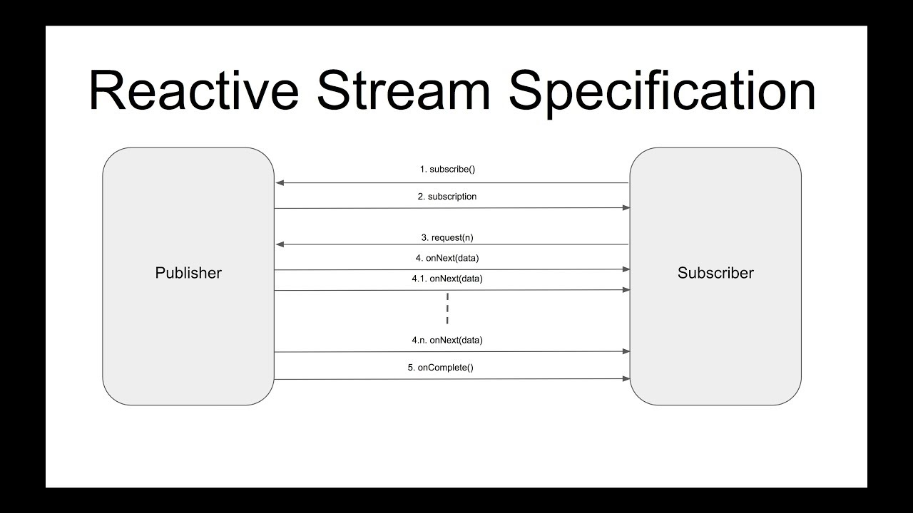

## Reactive Streams

---

## Table of Contents
<!-- TOC -->
  * [Reactive Streams](#reactive-streams)
  * [Table of Contents](#table-of-contents)
    * [Core interfaces](#core-interfaces)
  * [Reactive Streams Workflow](#reactive-streams-workflow)
  * [Operators and Transformations](#operators-and-transformations)
    * [Operator](#operator)
    * [Transformation](#transformation)
    * [Common Operators and Transformations](#common-operators-and-transformations)
  * [JDK9 java.util.concurrent.Flow](#jdk9-javautilconcurrentflow)
  * [Ref.](#ref)
<!-- TOC -->

---

Is a set of interfaces and rules that define a standard for *asynchronous stream processing with non-blocking backpressure* in Java. It was developed to address challenges in handling asynchronous and potentially unbounded streams of data, ensuring that data producers (*publishers*) don't overwhelm data consumers (*subscribers*) and lead to resource exhaustion.

<sub>[Back to top](#table-of-contents)</sub>

### Core interfaces

- #### Publisher
  Represents a source of data that emits items to subscribers. Publishers emit items one by one in response to subscriber requests.
  
  ```java
  import org.reactivestreams.Subscriber;
  
  public interface Publisher<T> {
      void subscribe(Subscriber<? super T> subscriber);
  }
  ```

  Publishers emit three types of signals: `onNext`, `onError`, and `onComplete`:
  - `onNext`: represents a regular data item
  - `onError`: indicates an error condition
  - `onComplete`: signals the end of the stream

<sub>[Back to top](#table-of-contents)</sub>

- #### Subscriber
  Represents a consumer of data emitted by a publisher. Subscribers signal demand for items (or signals) and receive them asynchronously.

  ```java
  import org.reactivestreams.Subscription;
  
  public interface Subscriber<T> {
      void onSubscribe(Subscription subscription);
      void onNext(T item);
      void onError(Throwable throwable);
      void onComplete();
  }
  ```
  A `Subscriber` requests a certain number of items from the Publisher (`request(n)`) and processes them as they arrive.

  Subscribers provide methods for handling each type of signal: 
    - `onNext` for processing data items
    - `onError` for handling errors
    - `onComplete` for handling the completion of the stream

<sub>[Back to top](#table-of-contents)</sub>

- #### Subscription
  Represents the connection between a subscriber and a publisher. It allows subscribers to request items and cancel their subscription.

  ```java
  public interface Subscription {
      void request(long n);
      void cancel();
  }
  ```
  A Subscription has several important responsibilities:

  - **Requesting Data**: The `Subscriber` uses the `Subscription` to *request a certain number of data items from the Publisher*. This is done through the `request(long n)` method provided by the Subscription. The Publisher then sends the requested number of items to the Subscriber.
  
  - **Cancelling Subscription**: The `Subscriber` can use the `Subscription` to cancel (`cancel()`) its subscription to the Publisher at any time. This *is important for managing resources* and ensuring that the Publisher stops emitting data if the Subscriber is no longer interested.
  
  - **Backpressure**: The `Subscription` allows the `Subscriber` to implement backpressure, which is a mechanism that allows the Subscriber to *control the rate at which it receives data from the Publisher*. If the Subscriber becomes overwhelmed by data, it can use backpressure to signal the Publisher to slow down or stop emitting data temporarily.

<sub>[Back to top](#table-of-contents)</sub>

- #### Processor
  Combines the roles of both publisher and subscriber. Processors transform, filter, or otherwise process items as they flow through the stream.
  
  ```java
  import org.reactivestreams.Publisher;
  import org.reactivestreams.Subscriber;
  
  public interface Processor<T, R> extends Subscriber<T>, Publisher<R> {
  }
  ```

<sub>[Back to top](#table-of-contents)</sub>

## Reactive Streams Workflow

The Reactive Streams workflow outlines how data flows and is processed through the different components of the reactive stream processing model, as defined by the *Reactive Streams Specification*. This workflow ensures that asynchronous data processing is *efficient*, *non-blocking*, and *well-controlled*, particularly in scenarios where data producers and consumers operate at different speeds.

High-level description of the Reactive Streams workflow:

- **Publisher**:

    - A data source, known as the Publisher, *emits data items (events) asynchronously*.
      - It implements the `Publisher` interface and provides the `subscribe()` method to establish a connection with a `Subscriber`.
      - The Publisher waits for a Subscriber to request data before emitting items. 
      - The Publisher pushes data to the Subscriber in response to requests.


- **Subscriber**:

    - A data consumer, known as the Subscriber, *receives and processes data items asynchronously*.
    - It implements the `Subscriber` interface and provides methods like `onSubscribe()`, `onNext()`, `onError()`, and `onComplete()`. 
    - When a Subscriber subscribes to a Publisher, it receives a Subscription object through the `onSubscribe()` method. 
    - The Subscriber requests data items from the Publisher by calling `request(n)` on the Subscription. 
    - Upon receiving data items via the `onNext()` method, the Subscriber processes the items.


- **Subscription**:

    - A Subscription represents the *connection between a Publisher and a Subscriber*.
    - It implements the `Subscription` interface and provides methods like `request(n)` and `cancel()`. 
    - The Subscriber uses the Subscription to request a specific number (n) of data items from the Publisher. 
    - The Subscription allows the Subscriber to control the flow of data by requesting items and canceling the subscription when done.
  

- **Backpressure Handling**:

    - Backpressure is a mechanism that *prevents a fast Publisher from overwhelming a slow Subscriber*.
    - The Subscriber signals its demand for items by calling `request(n)` on the Subscription. 
    - *The Publisher should emit data items at a pace that matches the Subscriber's requested demand*. 
    - The Publisher should buffer or otherwise handle excess items if the Subscriber can't keep up with the rate of emission.
  

- **Completion and Error Handling**:

    - When the Publisher has no more data to emit, it signals completion to the Subscriber by calling `onComplete()` on the Subscriber.
    - If an error occurs during processing, the Publisher signals the error to the Subscriber by calling `onError(Throwable)` on the Subscriber. 
    - Upon receiving an error or completion signal, the Subscriber stops requesting items and performs any necessary cleanup.


- **Processor** (Optional):

    - A Processor is an optional component that *combines the roles of both Publisher and Subscriber*.
    - It implements the `Processor` interface and allows data transformation, filtering, and processing. 
    - *Processors can modify or transform data items as they flow through the stream, before delivering them to Subscribers*.




<sub>[Back to top](#table-of-contents)</sub>

## Operators and Transformations

Operators and Transformations are used to _modify_, _filter_, _combine_, or otherwise _transform_ the data as it flows through the stream. Let's define these terms:

### Operator
- Operators are used to modify or manipulate the data emitted by a publisher (source) before it reaches a subscriber (consumer). They can perform operations like _filtering_, _mapping_, _merging_, and more. 


- Operators are typically chained together to create a pipeline of data transformations.

### Transformation
A transformation is a specific type of operator that _takes an input stream and produces an output stream where each element has been transformed in some way_.

### Common Operators and Transformations

- **map**: Transforms each element emitted by the source stream using a provided function. For example, you can transform a stream of integers to their squares using the map operator.


- **filter**: Filters the elements emitted by the source stream based on a provided predicate. Only elements that satisfy the predicate are allowed to pass through.


- **flatMap**: Applies a function to each element emitted by the source stream, resulting in multiple output elements for each input element. The output elements are then merged into a single output stream.


- **merge**: Combines multiple streams into a single output stream, interleaving the elements as they arrive from different sources.


- **concat**: Concatenates multiple streams in a sequential manner, ensuring that the elements from the first stream are emitted before the elements from the second stream, and so on.


- **reduce**: Aggregates the elements emitted by the source stream using an accumulator function, producing a single output element.

>These are just a few examples, and there are many more operators and transformations available in Reactive Streams libraries like Reactor or RxJava.

<sub>[Back to top](#table-of-contents)</sub>


## JDK9 java.util.concurrent.Flow
The interfaces available in JDK >= 9 `java.util.concurrent.Flow`, are 1:1 semantically equivalent to their respective Reactive Streams counterparts.

> This means that there will be a migratory period, while libraries move to adopt the new types in the JDK

<sub>[Back to top](#table-of-contents)</sub>

_____

## Ref.

- https://www.youtube.com/watch?app=desktop&v=WcUlm4Yu56A&ab_channel=JavaTechie
- http://reactive-streams.org
- https://www.youtube.com/watch?v=AoJVZ2sdqSc&ab_channel=Engineerhoon

___

[Get Started](../../../../../get-started.md) |
[Paradigms](../../../../../get-started.md#paradigms) |
[Reactive Programming](../../../paradigms/reactive.md) |
[Java](../java.md) |
[Java9](../versions.md#java-9)

___