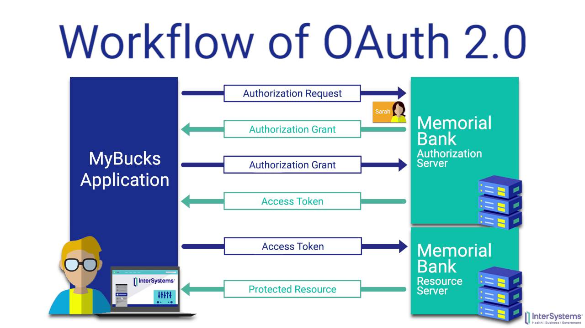

# OAuth

---

## Table of Contents

<!-- TOC -->
* [OAuth](#oauth)
  * [Table of Contents](#table-of-contents)
    * [OAuth Versions](#oauth-versions)
  * [How OAuth Works](#how-oauth-works)
    * [OAuth2.0 Roles](#oauth20-roles)
    * [OAuth Flow Steps](#oauth-flow-steps)
  * [Benefits of OAuth](#benefits-of-oauth)
  * [Grant Types](#grant-types)
    * [Authorization Code Flow](#authorization-code-flow)
    * [Implicit Flow](#implicit-flow)
    * [Client Credentials Flow](#client-credentials-flow)
      * [JWT Bearer Token Flow](#jwt-bearer-token-flow)
    * [Resource Owner Password Credentials Flow](#resource-owner-password-credentials-flow)
  * [Ref.](#ref)
<!-- TOC -->

---

OAuth (Open Authorization) is an open standard protocol that allows secure and controlled access to protected resources, such as user data or APIs, without the need to share a user's credentials (username and password) with the requesting application. It provides a standardized way for applications to request and obtain authorization to access resources on behalf of a user. OAuth is widely used in modern web and mobile applications to enable secure access to various services and APIs.

[Back to top](#table-of-contents)

### OAuth Versions
OAuth 2.0 logoOAuth 2.0 is the industry-standard protocol for authorization. It focuses on client developer simplicity while providing specific authorization flows for web applications, desktop applications, mobile phones, and living room devices. This specification and its extensions are being developed within the IETF OAuth Working Group.

OAuth 2.1 is an in-progress effort to consolidate OAuth 2.0 and many common extensions under a new name.

[Back to top](#table-of-contents)

## How OAuth Works

### OAuth2.0 Roles

OAuth involves four main roles: 

- **User (Resource Owner)**: The end-user who owns the protected resources and wants to grant access to a client application without sharing their credentials.

- **Client Application (Third-Party App)**: The application or service that wants to access the user's resources on their behalf. This can be a mobile app, a web app, or any other type of application.

- **Resource Server**: The server hosting the protected resources, such as an API service or a user's data.

- **Authorization Server**: The server responsible for authenticating the user and issuing access tokens to the client application.

[Back to top](#table-of-contents)

### OAuth Flow Steps

- **Authorization Request**: The client application initiates the OAuth flow by redirecting the user to the authorization server's endpoint with specific parameters, including the client ID, the requested scope (permissions), and a redirect URL.

- **User Consent**: At the authorization server, the user is presented with a login prompt and an authorization request from the client application. The user can review the requested permissions and grant consent to the client application.

- **Authorization Grant**: Once the user gives consent, the authorization server generates an `authorization grant` (e.g., an *authorization code*) and redirects the user back to the client application's redirect URL.

- **Access Token Request**: The client application exchanges the received `authorization grant` and its `client credentials` (client ID and client secret) with the authorization server to request an access token.

- **Access Token Issuance**: After verifying the `authorization grant` and `client credentials`, the authorization server issues an access token to the client application.

- **Accessing Protected Resources**: With the received access token, the client application can now make requests to the resource server on behalf of the user. The resource server validates the access token and serves the requested resources if the token is valid and has the necessary permissions.

[Back to top](#table-of-contents)

## Benefits of OAuth

- **Enhanced Security**: OAuth eliminates the need for applications to store and handle user credentials, reducing the risk of data breaches and unauthorized access.

- **User Control**: Users can review the permissions requested by the client application before granting access, giving them greater control over their data.

- **Scalability**: OAuth allows users to grant access to multiple client applications without sharing their credentials with each of them individually.

- **Single Sign-On (SSO) Support**: OAuth can be combined with other authentication protocols to enable seamless single sign-on experiences across multiple applications.

[Back to top](#table-of-contents)

## Grant Types

### Authorization Code Flow

(Standard Web Application Flow)

This is the most common and secure OAuth flow for web applications. It involves multiple steps, including redirecting the user to the authorization server for consent and obtaining an `authorization code`, which is then exchanged for an `access token`. This flow is suitable for *server-to-server* communication and allows for *token refresh*.

Flow steps are:

- The user is redirected to the authorization server's login page to authenticate.

- After successful authentication, the authorization server issues an authorization code to the client.

- The client exchanges this authorization code for an access token and a refresh token.

- The access token is then used to access protected resources on behalf of the user.

[Back to top](#table-of-contents)

### Implicit Flow

(Single-Page Application Flow)

The Implicit Flow is designed for *browser-based applications* and is commonly used in *single-page applications* (SPAs). Instead of obtaining an `authorization code`, the access *token is returned directly to the client* application after user consent. However, this flow does not support token refresh, which can be a security concern.

Flow steps are:

- The user accesses client application.

- Then client redirects user to authorization server for authentication.

- The user logs in and grants consent.

- Authorization server redirects user back to client with access token as a URL fragment.

- The client retrieves access token from URL fragment.

- Then the client uses access token retrieved to access protected resources.

[Back to top](#table-of-contents)

### Client Credentials Flow

The Client Credentials Flow is used when the client application (usually a server-side application) needs to *access its resources without acting on behalf of any specific user*. The client directly requests an access token from the authorization server using *its own credentials* (`client ID` and `client secret`).

Flow steps are:

- The client application sends its client ID and client secret to authorization server.

- Authorization server then validates client credentials.

- Authorization server issues an access token directly to the client.

- Client then uses access token to access protected resources.

[Back to top](#table-of-contents)

#### JWT Bearer Token Flow

> The JWT Bearer Token Flow is essentially a JWT (JSON Web Token) implementation of the OAuth 2.0 Client Credentials Flow

The JWT Bearer Token Flow is a simplified OAuth 2.0 flow designed for clients that are not capable of keeping client secrets, such as native mobile apps or single-page applications (SPAs). 

Flow steps are:

- The client requests an access token directly from the authorization server.

- The client authenticates using its client ID and a private key (usually through a JSON Web Key Set, or JWKs).

- The authorization server validates the client's identity and issues a signed JWT (JSON Web Token) as an access token.

- The client uses this JWT as a bearer token to access protected resources.

[Back to top](#table-of-contents)

### Resource Owner Password Credentials Flow

Is intended for trusted applications (e.g., *native mobile apps*) where the client application collects the user's username and password directly and sends them to the *authorization server* to obtain an `access token`. This flow should be used with caution due to potential security risks of handling user credentials.

Flow steps are:

- The user provides its username and password to client application.

- The client application sends user's credentials to authorization server.

- Then authorization server validates user credentials.

- Authorization server then issues an access token directly to the client.

- The client then uses access token to access protected resources.

>There are also extension grant types and custom flows that can be implemented based on specific requirements, but the four flows mentioned above are the core flows standardized by OAuth 2.0.

[Back to top](#table-of-contents)

___

## Ref.

- https://oauth.net/2/
- https://auth0.com/intro-to-iam/what-is-oauth-2

---

[Get Started](../../../get-started.md) |
[Web Services and API Design](../../../get-started.md#web-services-and-api-design)

___

