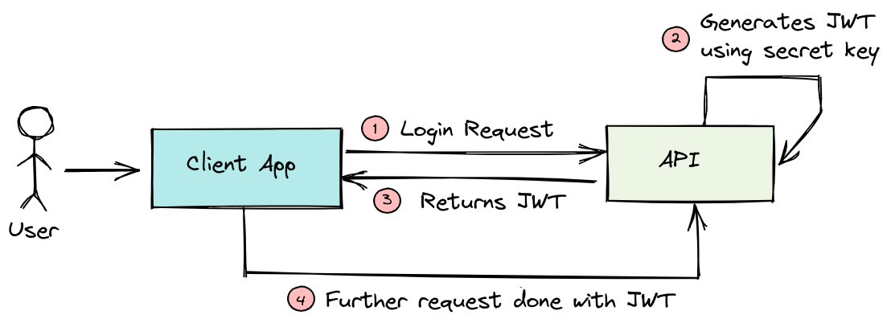

# JSON Web Token (JWT)

---

## Table of Contents
<!-- TOC -->
* [JSON Web Token (JWT)](#json-web-token-jwt)
  * [Table of Contents](#table-of-contents)
    * [Header](#header)
    * [Payload](#payload)
    * [Signature](#signature)
  * [JWT General usage](#jwt-general-usage)
    * [Authentication (AuthN)](#authentication-authn)
    * [Authorization](#authorization)
  * [Example](#example)
  * [JWT Bearer Token Flow](#jwt-bearer-token-flow)
  * [Other Common Flows Using JWT](#other-common-flows-using-jwt)
  * [Ref.](#ref)
<!-- TOC -->

---

JWT stands for JSON Web Token, and it is a compact and self-contained way of representing information between two parties. It is commonly used for *authentication* and *authorization* in web applications. 

JWTs are digitally signed, ensuring the integrity of the information they carry.

A JWT consists of three parts separated by dots: the *header*, the *payload*, and the *signature*. 

- The structure looks like this: `xxxxx.yyyyy.zzzzz`

<sub>[Back to top](#table-of-contents)</sub>


### Header
The header typically consists of two parts:

- The token type (JWT) 
- The signing algorithm used to create the signature. 

For example:

```json
{
  "alg": "HS256",
  "typ": "JWT"
}
```

<sub>[Back to top](#table-of-contents)</sub>


### Payload
The payload contains the *claims*. Claims are *statements about an entity* (typically the user) and additional data. 

There are three types of claims:
- Reserved
- Public
- Private

Reserved claims have predefined meanings, while public and private claims are custom to the application. 

For example:

```json
{
  "sub": "user123",
  "name": "John Doe",
  "admin": true
}
```

<sub>[Back to top](#table-of-contents)</sub>


### Signature
The signature is used to verify that the *sender of the JWT is who it claims to be*. It is created by taking the encoded header, encoded payload, a secret key, and the chosen signing algorithm. The output is then encoded again to form the signature.

<sub>[Back to top](#table-of-contents)</sub>


## JWT General usage
The process of using a JWT in a web application generally follows these steps:

### Authentication (AuthN)

- The user provides their credentials (e.g., username and password) to the authentication server.
- The server verifies the credentials and generates a JWT containing relevant claims.
- The JWT is returned to the user.

<sub>[Back to top](#table-of-contents)</sub>


### Authorization

- The user includes the JWT in the header or as a parameter in subsequent requests to protected resources (e.g., accessing an API endpoint).


- The server validates the JWT's signature using the secret key it possesses.


- If the signature is valid, the server parses the payload and checks the necessary claims to authorize the user's request.


- If the claims are valid and the user is authorized, the server processes the request and sends the response.


  


- See also: [AuthN & AuthZ](authn-authz.md)

<sub>[Back to top](#table-of-contents)</sub>


## Example
Now, let's demonstrate how to generate and verify a JWT in Python using the PyJWT library:

```python
# Install the PyJWT library if you haven't already: pip install PyJWT

import jwt
import datetime

# Example secret key (normally stored securely in a configuration file)
SECRET_KEY = "your_secret_key_here"

# Example payload with user information
payload = {
"user_id": 123,
"username": "john_doe",
"exp": datetime.datetime.utcnow() + datetime.timedelta(days=1)  # Expiration time (1 day from now)
}

# Generate a JWT token
token = jwt.encode(payload, SECRET_KEY, algorithm='HS256')

print("Generated JWT:", token)

# Demonstrate decoding and verification
try:
decoded_payload = jwt.decode(token, SECRET_KEY, algorithms=['HS256'])
    print("Decoded payload:", decoded_payload)
except jwt.ExpiredSignatureError:
    print("Token has expired.")
except jwt.InvalidTokenError:
print("Token is invalid.")
```

Remember to use a strong and secure secret key in production applications, and avoid storing sensitive information in the JWT payload as it is easily accessible to anyone who has the token.

<sub>[Back to top](#table-of-contents)</sub>


## JWT Bearer Token Flow

The **JWT Bearer Flow**, also known as **JWT Bearer Token Authentication**, is a specific authentication flow used in **OAuth 2.0** and **OpenID Connect** protocols. 

It allows clients (such as web applications or mobile apps) to request access tokens from an authorization server and use those tokens to access protected resources on a resource server (API).

- See also: [OAuth](oauth.md)
<!-- TODO:- See also: [OpenID Connect]() -->

Let's outline the steps involved in the **JWT Bearer Flow**:

1. **Client Request for Access Token**:
     - The client (e.g., web application) requests an access token from the authorization server by sending its credentials and authentication grant (e.g., username/password, client credentials, etc.).
     - The authorization server validates the client's credentials and grant and issues an access token.


2. **Accessing Protected Resources**:
     - With the access token obtained in Step 1, the client includes the token in the `Authorization` header of subsequent requests to the resource server (API).
     - The resource server receives the request and validates the access token.


3. **Token Validation**:
    - The resource server verifies the signature of the JWT using the public key of the authorization server (since JWTs are typically signed by the authorization server).

   - The resource server checks the token's expiration and other relevant claims to ensure the token is valid.

   - If the token is valid, the resource server processes the request and sends the response.


4. Token Expiration and Refresh:
     - If the access token has expired, the client can request a new one using a *refresh token* (if provided during Step 1) without requiring the user to re-enter their credentials.

     - The client can repeat the process of obtaining a new access token as needed.


<sub>[Back to top](#table-of-contents)</sub>


## Other Common Flows Using JWT

JWTs are commonly used in various authentication and authorization flows beyond the JWT Bearer Flow. Some of the popular authentication and authorization flows where JWTs are utilized include:


- **Implicit Flow**:
The Implicit Flow is another **OAuth 2.0** flow where the client (typically a single-page application) obtains an access token directly from the authorization endpoint. The access token is returned as a fragment in the URL. JWTs can be used as access tokens in this flow.


- **Authorization Code Flow**:
In the *Authorization Code Flow*, the client requests an authorization code from the authorization server, then exchanges it for an access token. The access token can be a JWT in some implementations, enhancing its security with the embedded claims.


- **Hybrid Flow**:
The Hybrid Flow combines elements of the Authorization Code Flow and the Implicit Flow. It allows clients to receive both an authorization code and an access token, or an authorization code that can be exchanged for an access token. JWTs can be used as access tokens in this flow.


- **OpenID Connect (OIDC)**:
*OpenID Connect* is built on top of *OAuth 2.0* and provides an identity layer for authentication. It specifies how to use JWTs as ID tokens, which contain user identity information and are used to authenticate users.


- **Single Sign-On (SSO)**:
JWTs are frequently used in Single Sign-On systems to represent user sessions across multiple applications or services. When a user logs in, they receive a JWT, which is then used to authenticate them across various related systems without the need to re-enter credentials.


- **Passwordless Authentication**:
JWTs can be used in passwordless authentication methods. Instead of traditional username/password combinations, a JWT can be issued after a successful authentication through means like email verification or magic links.


- **Custom Authentication and Authorization**:
JWTs offer flexibility and can be used in custom authentication and authorization mechanisms in various contexts, allowing developers to design secure and efficient authentication systems for their specific use cases.

>It's important to note that while JWTs offer certain advantages, such as being self-contained and reducing the need for server-side storage of session data, they must be used with caution. 

>It's crucial to implement proper security measures, including strong key management, token validation, and consideration of token expiration to minimize potential security risks associated with JWT-based authentication and authorization.

<sub>[Back to top](#table-of-contents)</sub>


___

## Ref.

- https://jwt.io/introduction
- https://datatracker.ietf.org/doc/html/rfc7519
- https://cloudsundial.com/salesforce-identity/jwt-bearer

---

[Get Started](../../../get-started.md) |
[Web Services and API Design](../../../get-started.md#web-services-and-api-design)

___