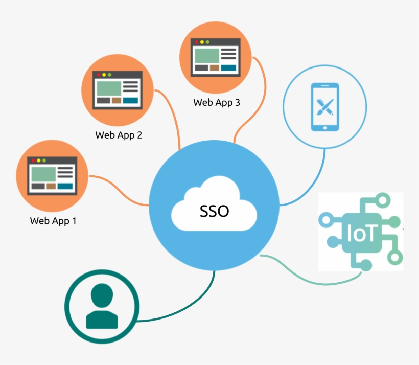

# Single Sign-On (SSO)

---

## Table of Contents
<!-- TOC -->
* [Single Sign-On (SSO)](#single-sign-on-sso)
  * [Table of Contents](#table-of-contents)
  * [Demonstration](#demonstration)
    * [Scenario:](#scenario)
    * [Steps:](#steps)
  * [Benefits of SSO:](#benefits-of-sso)
  * [Disadvantages of SSO](#disadvantages-of-sso)
  * [Ref.](#ref)
<!-- TOC -->

---

Single Sign-On (SSO) is an authentication and authorization process that allows users to access multiple applications or services *using a single set of credentials*. In other words, users only need to log in once, and then they can seamlessly access other applications without needing to log in again.

## Demonstration
Let's consider a practical demonstration of SSO using a fictional scenario involving three web applications: App1, App2, and App3. 
>For the purpose of this demonstration, we'll use a simplified example with a basic SSO protocol.

[Back to top](#table-of-contents)

### Scenario:
You need to implement SSO for three web applications: App1, App2, and App3. These applications are used by employees of a company to manage various tasks.

[Back to top](#table-of-contents)

### Steps:
- **User Access Request**:
  - You open your web browser and navigate to App1.
  - You're prompted with a login page to enter your credentials. 

- **SSO Authentication**:
  - After entering your credentials, App1's authentication system verifies your identity.
  - Instead of logging you in immediately, App1 generates an SSO token containing information about your authentication.

- **Access to Other Apps**:
  - You decide to access App2 and App3. 
  - When you navigate to App2, it detects that you don't have an active session. 
  - App2 redirects you to a central SSO provider, which is responsible for handling authentication across the applications.

  
- **Central SSO Provider**:
  - At the central SSO provider, you're redirected to a login page (or you might already have a session). 
  - You don't need to enter your credentials again because you're already authenticated with App1. 
  - The SSO provider generates an SSO token for App2 and signs it with a secret key.

- **Access Granted**:
  - The SSO provider redirects you back to App2 with the SSO token.
  App2 verifies the token's authenticity using the secret key shared with the SSO provider. 
  - Since the token is valid, App2 creates a session for you without requiring another login.

- **Seamless Access to App3**:
  - You decide to access App3. 
  - Similar to the previous steps, you're redirected to the SSO provider, and a token is generated for App3.
  

- **Final Access**:
  - App3 verifies the token, establishes a session, and grants you access without separate credentials.

[Back to top](#table-of-contents)

## Benefits of SSO:
- **Improved user experience**: Users only need to remember one set of credentials.

- **Enhanced security**: Centralized authentication can enforce stronger security measures.

- **Reduced password fatigue**: Users don't need to manage multiple passwords.

- **Efficient management**: Simplifies user provisioning and deprovisioning across applications.

>Please note that real-world SSO implementations can be more complex, involving protocols like **OAuth 2.0**, **OpenID Connect**, **SAML**, and more. This demonstration provides a basic overview of how SSO works conceptually.

- See also: [OAuth](oauth.md)
- See also: [OpenID Connect](openid-connect.md)
- Se also: [SAML](saml.md)

[Back to top](#table-of-contents)

## SSO Protocols

### SAML
SAML, or Security Assertion Markup Language, is a protocol or set of rules that applications use to exchange authentication information with the Single Sign-On (SSO) service. SAML uses **XML**, a browser-compatible markup language, to exchange user identification data. SAML-based SSO services provide greater security and flexibility as applications do not need to store user credentials in their system.

- Se also: [SAML](saml.md)

[Back to top](#table-of-contents)

### OAuth
OAuth, or Open Authorization, is an open standard that allows applications to securely access user information from other websites without being given the password. Instead of requesting user passwords, applications use OAuth to obtain user permission to access password-protected data. OAuth establishes trust between applications through the API, enabling the application to send and respond to authentication requests within a defined framework.

- See also: [OAuth](oauth.md)

[Back to top](#table-of-contents)

### OIDC
  OpenID is a way to use a single set of user credentials to access multiple sites. It allows the service provider to take on the role of authenticating user credentials. Instead of passing an authentication token to an external identity provider, web applications use OIDC to request additional information and validate the authenticity of the user.

- See also: [OpenID Connect](openid-connect.md)

[Back to top](#table-of-contents)

### Kerberos
  Kerberos is a ticket-based authentication system that enables two or more parties to mutually verify their identities over a network. It uses secure cryptography to prevent unauthorized access to identification information transmitted between the server, clients, and key distribution center.

[Back to top](#table-of-contents)

## Disadvantages of SSO

While Single Sign-On (SSO) offers many benefits, there are also some criticized points and potential challenges associated with its implementation. It's important to consider these aspects when deciding whether to adopt SSO for your applications:

- **Central Point of Failure**:
If the Identity Provider (IdP) experiences downtime or a security breach, all associated Service Providers (SPs) and their users may be affected.
Proper redundancy and security measures must be in place for the IdP to minimize this risk.

- **Complex Implementation**:
Implementing SSO can be complex and require a deep understanding of various protocols and technologies.
Misconfigurations or errors in setup can lead to security vulnerabilities or failed authentication.

- **User Privacy Concerns**:
Sharing user attributes between the IdP and SPs can raise privacy concerns, especially if not handled properly.
Users might be uncomfortable with the amount of personal information being shared across multiple services.

- **User Experience Challenges**:
SSO might create a seamless experience once set up, but the initial configuration and login flows can confuse users.
Users might have difficulty understanding when they are logged out from one application but still have active sessions in others.

- **Vendor Lock-In**:
Adopting a specific SSO protocol or solution might lead to vendor lock-in, making it challenging to switch to a different solution in the future.

- **Security Risks and Attacks**:
SSO introduces new attack vectors. If an attacker gains access to a user's SSO credentials, they could potentially access multiple services.
Attacks on the IdP could have wide-ranging consequences.
Poor implementation of SSO protocols can lead to vulnerabilities like session fixation or token hijacking.

- **Compatibility and Integration**:
Integrating SSO with existing legacy systems might require significant effort and customization.
Some applications may not be compatible with the chosen SSO protocol, necessitating additional workarounds.

- **Maintenance and Updates**:
Ongoing maintenance of the SSO infrastructure, including updates and patches, is crucial to ensure security and reliability.
Changes in protocols or updates to applications might require adjustments to the SSO configuration.

- **User Account Management**:
Managing user accounts across multiple applications can become complex, especially when provisioning and deprovisioning users.

- **Limited Use Cases**:
SSO might not be suitable for all types of applications. Some applications, such as highly sensitive systems, might require traditional authentication methods.

- **Costs and Resources**:
Implementing and maintaining an SSO solution can involve significant costs, including licensing fees for commercial IdPs or resources for building and maintaining an in-house solution.

[Back to top](#table-of-contents)

___

## Ref.

- https://en.wikipedia.org/wiki/Single_sign-on
- https://auth0.com/intro-to-iam/what-is-single-sign-on-sso

---

[Get Started](../../../get-started.md) |
[Web Services and API Design](../../../get-started.md#web-services-and-api-design)

___

