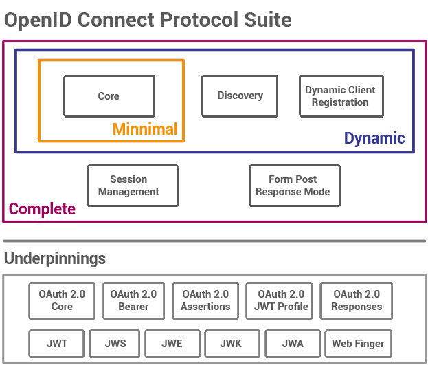
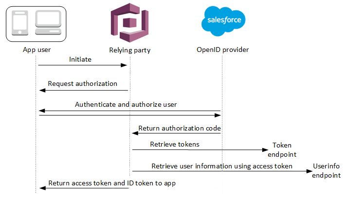

# OpenID Connect (OIDC)

---

## Table of Contents

<!-- TOC -->
* [OpenID Connect (OIDC)](#openid-connect-oidc)
  * [Table of Contents](#table-of-contents)
  * [Components and Functionality](#components-and-functionality)
  * [Basic OIDC AuthN Flow](#basic-oidc-authn-flow)
  * [OIDC Flows](#oidc-flows)
  * [Example](#example)
  * [OIDC Providers](#oidc-providers)
  * [Ref.](#ref)
<!-- TOC -->

---

OpenID Connect (OIDC) is an *authentication* and *authorization* protocol built on top of the **OAuth 2.0** framework. It's designed to provide a standardized and secure way for web applications, mobile apps, and other clients to authenticate users and obtain their basic profile information while ensuring their privacy and security.

The primary purpose of OpenID Connect is to enable **Single Sign-On** (SSO) and identity federation across different services and applications. It allows a user to authenticate once with an **Identity Provider** (IDP), often using their existing credentials (like those from a social media account or an organization's directory service), and then use that authenticated session to access multiple applications without needing to log in separately for each one.



<sub>[Back to top](#table-of-contents)</sub>

## Components and Functionality

- **Relying Party (RP)**:
This is the application that wants to authenticate users and access their profile information. It could be a web application, mobile app, or even a backend service.


- **Identity Provider (IDP)**:
The IDP is responsible for authenticating users and providing them with `identity tokens`. It verifies the user's credentials and issues tokens that can be used by the RP to access user information.

  
- **Authorization Server (AS)**:
This component is responsible for issuing `access tokens` and `identity tokens` after a successful authentication. It also manages the user's consent to share information with the RP.


- **User-Agent**:
The user's web browser or another user agent is involved in the authentication flow, usually by redirecting the user to the IDP's login page and handling the redirection back to the RP after authentication.


- **ID Token**:
This is a **JSON Web Token** (JWT) that contains information about the authenticated user, such as their *identity and basic profile attributes*. It is digitally signed by the IDP and can be validated by the RP to ensure its integrity.


- **Access Token**: 
This token is used by the RP to access `protected resources` on behalf of the user. It provides temporary authorization and can be used to make requests to resource servers.


- **UserInfo Endpoint**
The IDP provides an endpoint where the RP can request *additional user information*, such as email, name, and profile picture, using the access token.


- **Scopes**:
Scopes define the *level of access* and the *type of information the RP is allowed to request*. They are defined during the authorization request and consent process.


- **Redirects and Callbacks**:
The authentication flow involves multiple redirects between the RP, IDP, and user agent. After successful authentication, the user agent redirects back to the RP with tokens.


<sub>[Back to top](#table-of-contents)</sub>

## Basic OIDC AuthN Flow

Basic flow of how the OpenID Connect (OIDC) authentication process works:

- **User Initiates Authentication**:
    - The user attempts to access a protected resource on the RP.
    - Since the resource is protected, the RP detects that the user is not authenticated and initiates the authentication process.


- **Client Sends Authentication Request**:
  - The RP generates an authentication request and sends it to the Authorization Server (which is often the same as the Identity Provider, IDP).

  
- **User is Redirected to IDP**:
  - The Authorization Server (AS) performs some checks and then redirects the user's web browser to the IDP's login page.
  - The user enters their credentials (username and password) on the IDP's login page.
 

- **User Authenticates with IDP**:
  - The user's credentials are verified by the IDP.
  - If the authentication is successful, the IDP generates an ID Token and an Access Token.

  
- **IDP Redirects User Back to Client Application**:
  - The IDP sends the user's web browser back to the RP's designated redirect URI along with the ID Token and Access Token as query parameters.


- **Client Validates ID Token**:
  - The RP receives the ID Token.
  - The client validates the ID Token's signature to ensure its authenticity. 
  - The client verifies that the token is intended for its client ID. 
  - The client extracts user information and uses it for various purposes, such as displaying the user's name or profile picture.

    
- **Client Uses Access Token**:
  - The client can use the Access Token to request additional user information from the UserInfo Endpoint if needed. 
  - The client may also use the Access Token to access protected resources on resource servers by including it in the request headers.

  
- **User is Authenticated**:
  - The RP considers the user authenticated and grants them access to the requested resource.


 
>It's important to note that during the flow, there can be additional steps to handle scenarios like obtaining user consent, handling token expiration and renewal, and dealing with errors. The specific implementation might vary depending on the OIDC provider and the RP's requirements.

>Also, keep in mind that OIDC is built on top of OAuth 2.0, so the flow involves OAuth 2.0 concepts like authorization codes, access tokens, refresh tokens, and more. The OIDC layer adds the ID Token and user authentication aspects to the OAuth 2.0 framework.
 
 - See also: [OAuth](oauth.md)

<sub>[Back to top](#table-of-contents)</sub>

## OIDC Flows
The choice of OpenID Connect flow depends on the type of application and its security requirements. There are three common flows:

- **Implicit Flow**: In this flow, commonly used by SPAs, tokens are returned directly to the RP in a redirect URI.


- **Authorization Code Flow**: This flow is more secure than Implicit, as tokens are not returned directly. For native/mobile apps and SPA, security may be enhanced by using Proof Key for Code Exchange.


- **Hybrid Flow**: Combining Implicit and Authorization Code flows, here, the ID Token is returned directly to the RP, but the access token is not. Instead, an authorization code is returned that is exchanged for an access token.


<sub>[Back to top](#table-of-contents)</sub>


## Example

Simplified example of how you might implement the OpenID Connect (OIDC) authentication flow in a web application using a JavaScript client and a mock Identity Provider (IDP) using the Implicit Flow. In this example, we'll use a fictional IDP called "MockIDP."

```html
<!DOCTYPE html>
<html>
<head>
  <title>OIDC Authentication Example</title>
</head>
<body>
  <button onclick="login()">Login</button>
  <div id="profile" style="display: none;">
    <h2>Welcome, <span id="username"></span>!</h2>
    
  </div>

  <script>
    function login() {
      // Construct OIDC authorization URL
      const clientId = 'your_client_id';
      const redirectUri = 'http://localhost:3000/callback'; // Replace with your callback URL
      const authorizationUrl = `https://mockidp.com/auth?client_id=${clientId}&redirect_uri=${redirectUri}&response_type=token&scope=openid%20profile&nonce=12345`;

      // Redirect to IDP for login
      window.location.href = authorizationUrl;
    }

    function handleCallback() {
      // Parse hash fragment from URL
      const hashParams = window.location.hash.substr(1).split('&').reduce((result, item) => {
        const parts = item.split('=');
        result[parts[0]] = parts[1];
        return result;
      }, {});

      if (hashParams.access_token) {
        // Display user profile
        document.getElementById('username').textContent = hashParams.name;
        document.getElementById('profile-picture').src = hashParams.picture;
        document.getElementById('profile').style.display = 'block';
      }
    }

    // Call the callback handler when the page loads
    window.onload = handleCallback;
  </script>
</body>
</html>

```

- The web page has a "Login" button that triggers the OIDC authentication flow when clicked. The login function constructs the OIDC authorization URL and redirects the user to the mock IDP for authentication.


- Once the user is authenticated and redirected back to the application, the handleCallback function parses the hash fragment from the URL and extracts the access token, user's name, and profile picture. It then displays this information in the user's profile section on the page.


>Remember that this example uses a simplified mock IDP and Implicit Flow for demonstration purposes. In a real-world scenario, you'd use a proper OIDC library or framework and follow best practices to ensure the security and reliability of the authentication process.


<sub>[Back to top](#table-of-contents)</sub>


## OIDC Providers

Here are some of the commonly used and recommended OIDC providers:

- **Auth0**: Auth0 is a widely used and developer-friendly identity management platform that offers OIDC and OAuth 2.0 authentication and authorization solutions. It provides various features, including Single Sign-On (SSO), social logins, multi-factor authentication, and customizable login screens.


- **Okta**: Okta is another popular identity and access management platform that supports OIDC and OAuth 2.0. It offers features like SSO, adaptive authentication, user lifecycle management, and integrations with various application types.


- **Keycloak**: Keycloak is an open-source identity and access management solution developed by Red Hat. It offers OIDC, OAuth 2.0, and SAML support, along with user federation, social logins, and customizable authentication flows.


- **Ping Identity**: Ping Identity provides comprehensive identity solutions, including OIDC support. It offers features like SSO, strong authentication, adaptive access policies, and centralized identity management.


- **Microsoft Azure Active Directory**: Azure AD is Microsoft's cloud-based identity service that supports OIDC and is widely used for authenticating and managing users in Azure and other Microsoft services. It's suitable for both cloud and on-premises applications.


- **Google Identity Platform**: Google provides an identity platform that supports OIDC for integrating Google's authentication services into applications. It's commonly used for applications that want to offer Google or Gmail-based logins.


- **OneLogin**: OneLogin is a cloud-based identity management solution that supports OIDC and provides SSO, user provisioning, and adaptive authentication capabilities.


- **Cognito (Amazon Web Services)**: Amazon Cognito is a service that offers authentication, authorization, and user management for web and mobile applications. It supports OIDC along with features like user pools, identity pools, and social logins.


- **FusionAuth**: FusionAuth is an open-source identity platform that supports OIDC and offers features like user registration, authentication, and authorization.


- **Gluu**: Gluu is an open-source identity and access management platform that supports OIDC, OAuth 2.0, and other authentication protocols. It provides features like SSO, adaptive authentication, and customizable workflows.


>These providers vary in terms of features, pricing, ease of integration, and target audience. When choosing an OIDC provider, consider factors such as the specific requirements of your application, security features, scalability, and developer experience. It's also a good practice to review the latest documentation and user reviews to make an informed decision.

<sub>[Back to top](#table-of-contents)</sub>

___

## Ref.

- https://auth0.com/intro-to-iam/what-is-openid-connect-oidc
- https://openid.net/developers/how-connect-works/

---

[Get Started](../../../get-started.md) |
[Web Services and API Design](../../../get-started.md#web-services-and-api-design)

___
